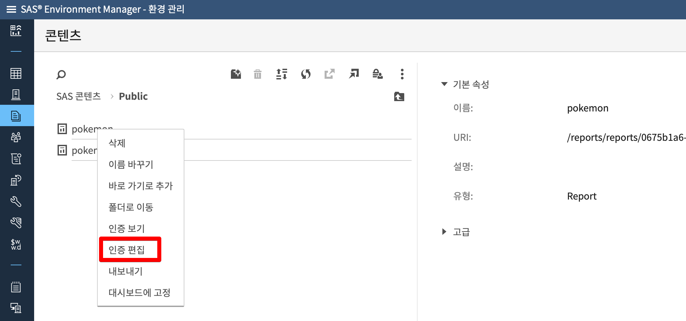
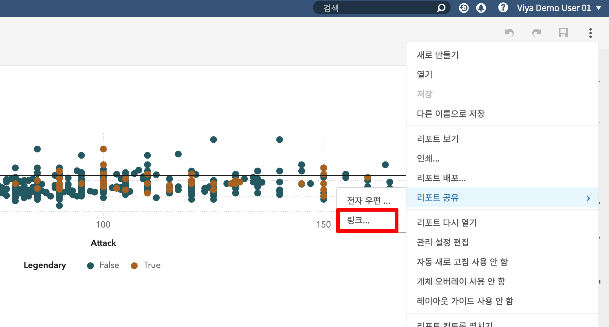

## VA8.3 리포트 연계시 로그인 없는 링크 제공 방법

로그인 없는 링크는 리포트 공유 뿐 아니라, 외부 사이트에 IFRAME 을 사용하여 리포트 EMBED 시에 유용하게 사용 할 수 있는 기능 입니다.

[TOC]

> 1번 및 2번의 경우 SAS Viya Admin 이 한번 만 수행하면 됨.

### 1. Configuration Manager 에서 Guest 계정 활성화

+ SAS Viya 로그인후 환경 관리 > 구성 > 정의 > sas.logon.provider.guest 활성화 에서 "enabled" 활성화 시키기


### 2. sas-admin 명령을 이용한 인증관련 설정 변경

아래 명령어를 root 계정 혹은 sudo 가능 한 계정으로 접속 하여 수행 합니다.

#### 2-1. SSL 통신을 위한 인증서 설정

```bash
export SSL_CERT_FILE=/opt/sas/viya/config/etc/SASSecurityCertificateFramework/cacerts/trustedcerts.pem
```

#### 2-2. sas-admin 인증을 위한 기본 프로파일 생성

```bash
[root@viyademo ~] sas-admin profile init
구성 옵션 입력:

서비스 끝점> https://viyademo.sas.com

출력 유형 (text|json|fulljson)> text
```

#### 2-3. 기본 프로파일을 이용한 로그인

사용자 ID 는 VA 서버에 로그인 하는 사용자 ID 이며, Admin 권한이 있는 계정으로 입력 해야함

```
[root@viyademo ~] sas-admin auth login
https://viyademo.sas.com에 대한 자격 증명 입력:

사용자 ID> {viya-user-name}

암호> {viya-password}
로그인에 성공했습니다. 토큰이 저장되었습니다.
```

#### 2-4. Guest Access 활성화

```
/opt/sas/viya/home/bin/sas-admin authorization facilitate-guest
```

#### 2-5. Guest 계정의 디렉토리 생성

```bash
mkdir /opt/sas/viya/home/share/guest
chown -R sas:sas /opt/sas/viya/home/share/guest/
```

#### 2-6. Guest 계정

~~~bash
sas-admin cas facilitate-guest --source-file  /opt/sas/viya/home/share/guest --server cas-shared-default --superuser
~~~

#### 2-7. CAS 라이브러리에 대한 권한 부여 

~~~bash
/opt/sas/viya/home/bin/sas-admin cas caslibs add-control --server cas-shared-default --caslib PUBLIC --grant readInfo --guest --superuser

/opt/sas/viya/home/bin/sas-admin cas caslibs add-control --server cas-shared-default --caslib PUBLIC --grant select --guest --superuser

/opt/sas/viya/home/bin/sas-admin cas caslibs add-control --server cas-shared-default --caslib PUBLIC --grant limitedPromote --guest --superuser
~~~


### 3. 리포트 권한 편집

생성된 리포트 오브젝트에 대한 GUEST 가 접근 가능 하도록 인증 내용을 편집 합니다. 

#### 3-1. 인증편집





### 4. VA 리포트 편집에서 공유 대상 리포트 공유

데이터탐색 및 시각화 > 리포트 공유 > 링크 를 선택후 링크를 생성 및 복사 합니다.




#### 4-1. "게스트 엑세스" 를 허용한 링크 복사

리포트에 대한 링크 생성시 아래 화면과 같이 "게스트 엑세스" 항목이 추가된 것을 확인 할 수 있습니다.


#### 4-2. 로그아웃 후 새로운 창에 링크 붙여넣어 테스트 

Guest 계정으로 별도의 로그인 없이 리포트가 보이는 것을 확인 할 수 있습니다.


### 5. 외부 사이트 삽입

#### 5-1. 삽입 가능한 링크 복사


#### 5-2. HTML 파일에 삽입

~~~
<html>
    <head>
    </head>
    <body>
        <iframe height="768" width="1024" src="https://xxx.xxx.xxx.xxx/SASReportViewer/?reportUri=%2Freports%2Freports%2F0675b1a6-6cd2-485a-be73-c7984c2dc9b1&page=vi6&sso_guest=true&reportViewOnly=true&appSwitcherDisabled=true"></iframe>
    </body>
</html>
~~~


#### 5-3. 브라우저에서 테스트

html 파일을 브라우저에 에서 열어 보면 아래 그림과 같이 리포트 내용 자체가 html 페이지 안에 로그인 없이 Embed 되는 것을 확인 할 수 있습니다.


좀더 상세한 사항은 아래 링크를 참조 하시면 됩니다.

참고 : [GUEST 접속 관련 설정 온라인 메뉴얼](https://go.documentation.sas.com/?docsetId=calauthmdl&docsetTarget=n067qoyrgu1yohn19nq4ehy8o0b3.htm&docsetVersion=3.3&locale=en#p0jrliplx9dz0an11jdxlc7s15wq)


