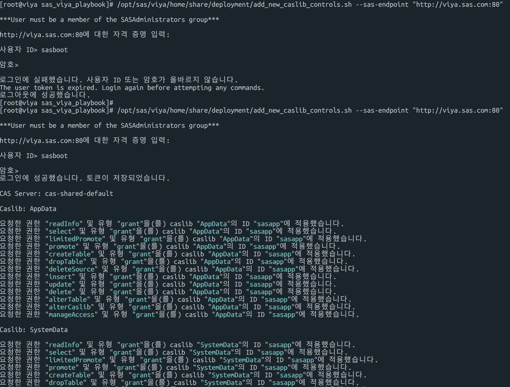
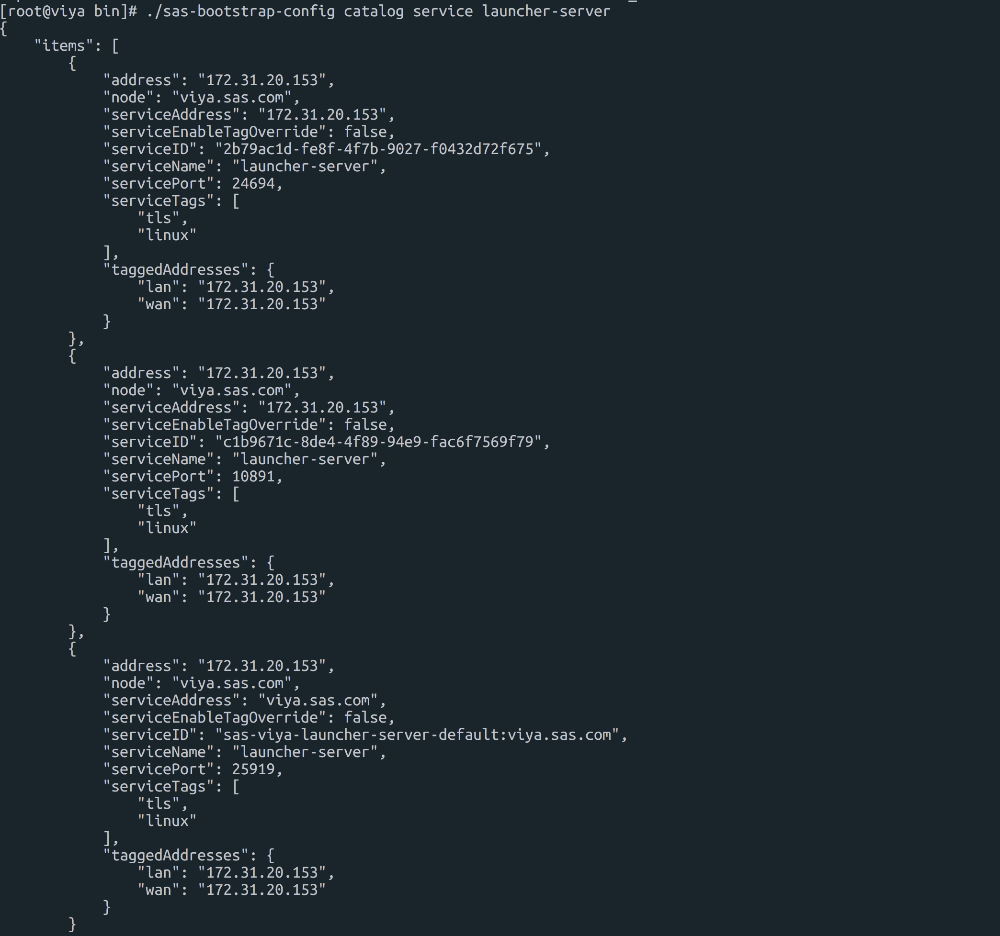
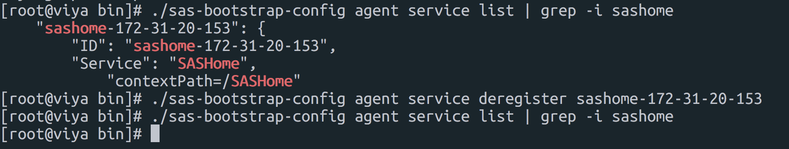

## GUIDE for SAS viya upgrade to 3.4

[TOC]

온라인 문서 위치 : [github](https://github.com/dangtong76/sas-book/blob/master/posts/SAS_Viya_upgrade_guide.md) , [gitbook](https://sas.gitbook.io/sas-guide/posts/sas_viya_upgrade_guide)

### 1. 접속정보 및  디렉토리 구조 

이번 업그레이드 교육을 위한 서버 정보입니다. 해당 서버에는 이미 3.3 버전이 설치 되어 있습니다.

#### 접속정보

ssh 접속을 위한 key 파일 : [다운로드](https://www.dropbox.com/s/293y8n3oonfma4c/sas-viya-key.pem?dl=1)

| hostname          | public-ip    | private-ip    | OS Account | Viya account |
| ----------------- | ------------ | ------------- | ---------- | ------------ |
| samsung01.sas.com | 52.79.135.22 | 172.31.28.123 | ec2-user   | sasboot      |
| samsung02.sas.com | 54.180.37.53 | 172.31.5.204  | ec2-user   | sasboot      |

#### 디렉토리 구조

| 디렉토리            | 설명                                   |
| ------------------- | -------------------------------------- |
| /opt/install        | 3.3 인스톨 수행 디렉토리               |
| /opt/upgrade        | 3.4 인스톨 수행 디렉토리               |
| /opt/upgrade/mirror | 3.4 인스톨 미러 리포지토리 (필수 아님) |
| /opt/install/mirror | 3.3 인스톨 미러 리포지토리 (필수 아님) |

> 미러 리포지토리가 필수는 아니지만, 본 가이드에서는 미러 리포지토리가 있느다는 가정하에 진행 합니다.


### 2. 업그레이드에 필요한 유틸리티

#### 디렉토리 생성

```{bash}
mkdir /opt/upgrade # 업그레이드 소프트웨어 인스톨 디렉토리
mkdir /home/ec2-user/upgrade # 업그레이드용 파일 보관
```


#### 파일 다운로드 및 업로드

| 파일명                       | 설명                                                     | 다운로드 링크                                                |
| ---------------------------- | -------------------------------------------------------- | ------------------------------------------------------------ |
| sas-orchestration-linux.tgz  | ansible 플레이북 생성                                    | [다운로드](https://support.sas.com/en/documentation/install-center/viya/deployment-tools/34/command-line-interface.html) |
| mirrormgr-linux.tgz          | 설치 파일 다운로드 및 yum 로컬 리포지토리 구성 (1-6참조) | [다운로드](https://support.sas.com/en/documentation/install-center/viya/deployment-tools/34/mirror-manager.html) |
| SAS_Viya_deployment_data.zip | 라이센스 및 제품 목록 (1-4 참조)                         | 메일첨부                                                     |

> 다운로드 받은 파일을 서버의 /home/ec2-user/upgrade 에 업로드 합니다.


#### Mirror Manager 압축풀기

먼저 mirror manager 의 압축을 풉니다.

```
tar -xvf mirrormgr-linux.tgz
```


#### SAS 미러 리포지토리 만들기

명령어 : mirrormgr mirror --deployment-data {path-to-SOE-file} --path {mirror-path} --platform {platform-tag} --log-file {log-file-path} --latest

```
./mirrormgr mirror --deployment-data /home/ec2-user/upgrade/SAS_Viya_deployment_data.zip --path /opt/upgrade/mirror --platform x64-redhat-linux-6 --log-file /home/ec2-user/upgrade/mirrormgr.log --latest
```


#### Ansible Playbook 생성

Ansible 을 통해 Viya3.4 업그레이드를  위해 ansible-playbook 을 생성 합니다. SOE 메일에 적힌 라이센스 허가 목록에 대해서만 Ansible playbook이 자동 생성 됩니다.

```
# 압축 풀기
tar -xvf sas-orchestration.tgz

# Ansible Play Book 생성
./sas-orchestration build --input /home/ec2-user/upgrade/SAS_Viya_deployment_data.zip --repository-warehouse "file:///opt/upgrade/mirror" --platform redhat

# 플레이북 파일 install 디렉토리로 이동
cp SAS_Viya_playbook.tgz /opt/upgrade/

# 플레이북 압축 풀기
cd /opt/upgrade
tar -xvf SAS_Viya_playbook.tgz
```

> Platform TAG 정보는 oracle linux , redhat linux 의 경우 **redhat**, 수세리눅스의 경우 **suse**


### 3. 설정 파일 비교 및 구성

이전 구성에서 수정한 부분을 3.4 용 설치 파일과 비교하여 옯겨 그대로 적어 줍니다. 

#### 수정되지 않은 3.3 vars.yml 파일 복사

~~~{bash}
cp /opt/install/sas_viya_playbook/samples/vars.yml /opt/upgrade/sas_viya_playbook/vars_original.yml
~~~

#### 3.3 인스톨시 수정된 vars.yml 파일 복사

~~~{bash}
cp /opt/install/sas_viya_playbook/vars.yml /opt/upgrade/sas_viya_playbook/vars_current.yml
~~~

#### vars.yml 파일비교 및 구성

~~~{bash}
cd /opt/upgrade/sas_viya_playbook
diff vars_current.yml vars.yml
~~~

#### inventory.in 파일 복사

```{bash}
cp /opt/install/sas_viya_playbook/inventory.ini /opt/upgrade/sas_viya_playbook/inventory_current.ini
```

#### inventory.ini 파일 비교

```{bash}
cd /opt/upgrade/sas_viya_playbook
diff inventory_current.ini inventory.ini 
```

#### 

#### 기존 sas 리포지토리 비활성화

/etc/yum.repos.d/ 디렉토리 밑의 yum 리포지토리 정보를 삭제 하는 명령 입니다. 해당 리포지토리는 3.3 버전의 리포지토리 정보가 있기 때문에 비활성화 시키지 않으명, 이전 버전을 중복해서 설치하게 됩니다.

~~~bash
ansible all -m shell --become --become-user=root -a 'yum remove --assumeyes $(rpm -qf --qf "::%{group}::%{name}\n" /etc/yum.repos.d/*.repo | sed -e "/^::SAS::/!d" -e "s/^::SAS:://" | sort -u)'
~~~


> /etc/yum.repos.d/sas.repo 파일의 미러 리포지토리 경로가  upgrade 경로로 변경 됩니다.


### 4. Viya3.4 인스톨

#### 소프트웨어 설치전 Assesment 수행

업그레이드를 위한 검증을 수행 할 뿐만 아니라, 위에서 비활성화 시킨 리포지토리 내용을 3.4 버전으로 새로 만들어 줍니다.

~~~{bash}
ansible-playbook system-assessment.yml
~~~

> /etc/yum.repos.d 디렉토리에 sas 리포지토리가 생성 되었는지 확인 하십시요


#### 인스톨 수행

```
ansible-playbook -vvv site.yml # 포그라운드 수행
or
nohup ansible-playbook -vvv site.yml & # 백그라운드 수행
```


#### 로그 확인

설치가 끝나고 로그를 확인하면 Warning 메시지가 계속 나타 납니다. 설치는 정상적으로 되었지만, 신규 버전에서 사용하지 않는 서비스및 모니터링을 제거 해주어야 합니다. 해당 작업은 **설치 후속작업** 에서 수행 합니다.

~~~{bash}
cd /opt/sas/viya/config/var/log
tail -f ./*/default/*.log
~~~


### 5. 설치 후속 작업

#### 신규 caslib 추가 및 권한 부여 

~~~
/opt/sas/viya/home/share/deployment/add_new_caslib_controls.sh --sas-endpoint "http://viya.sas.com:80"
~~~




#### 서비스 비활성화

##### 부트스트랩 서비스 환경변수 재설정

~~~{bash}
. /opt/sas/viya/config/consul.conf
~~~

> 부트스트랩 서비스가 3.3 버전에서는 8500 포트로 서비스 되지만 3.4 부터는 8501 포트로 서비스됨


##### Consul 토큰 설정

~~~{bash}
export CONSUL_TOKEN=$(sudo cat /opt/sas/viya/config/etc/SASSecurityCertificateFramework/tokens/consul/default/client.token)
~~~


##### launcher-server 등록 정보 검색

~~~{bash}
cd /opt/sas/viya/home/bin/
~~~

~~~{bash}
./sas-bootstrap-config catalog service launcher-server
~~~




##### viya 3.3 버전의 launcher 서비스 비활성화

~~~{bash}
./sas-bootstrap-config agent service deregister c1b9671c-8de4-4f89-94e9-fac6f7569f79

./sas-bootstrap-config agent service deregister 2b79ac1d-fe8f-4f7b-9027-f0432d72f675
~~~


~~~{bash}
./sas-bootstrap-config agent service list | grep -i backup-agent
~~~


~~~{bash}
./sas-bootstrap-config agent service deregister {ID}
~~~


#### 서비스 비활성화 및 모니터링 제거

##### Viya 3.2 로부터 업그레이드 시 비활성화 및 모니터링 제거 대상 서비스

| 항목                    | 서비스명                             |
| ----------------------- | ------------------------------------ |
| SASHome                 | service name=sashome                 |
| home                    | service name=home                    |
| recipeExecutionProvider | service name=recipeexecutionprovider |
| SASVisualDataBuilder    | service name=sasvisualdatabuilder    |
| data-preparation-plans  | service name=data-preparation-plans  |

##### Viya 3.3 로부터 업그레이드 시 비활성화 및 모니터링 제거 대상 서비스

| 항목          | 서비스명                              |
| ------------- | ------------------------------------- |
| SASHome       | service name=sashome                  |
| home          | service name=home                     |
| SASJobMonitor | service name=datamanagementjobmonitor |
| SASProjects   | service name=datamanagementproject    |


#### 모니터링 제거 대상 조회

~~~{bash}
./sas-bootstrap-config agent check list | grep -i sashome
./sas-bootstrap-config agent check list | grep -i home
./sas-bootstrap-config agent check list | grep -i datamanagementjobmonitor
./sas-bootstrap-config agent check list | grep -i datamanagementproject
~~~


#### 모니터링 제거

~~~{bash}
./sas-bootstrap-config agent check deregister --id service:service-name-10-123-4-56
~~~


#### 비활성화 대상 서비스 조회

~~~{bash}
./sas-bootstrap-config agent service list | grep -i sashome
./sas-bootstrap-config agent service list | grep -i home
./sas-bootstrap-config agent service list | grep -i datamanagementjobmonitor
./sas-bootstrap-config agent service list | grep -i datamanagementproject
~~~


#### 서비스 비활성화

~~~{bash}
./sas-bootstrap-config agent service deregister service-name-10-123-4-56
~~~




#### 로그 링크 생성

~~~bash
ln -s /opt/sas/viya/config/var/log /var/log/sas/viya
ln -s /opt/sas/spre/config/var/log /var/log/sas/spre
~~~


#### 로그 확인

```{bash}
cd /var/log/sas/viya
tail -f ./*/default/*.log
```


