[TOC]

## Preface

실습에 사용되는 데이터셋 은 아래 URL 에서 다운 받을수 있습니다.

## 1. SAS Drive

### 실습 1-1. 빠른 엑세스 영역에 컨텐츠 추가 하기

>SAS Drive → 모두 → SAS 콘텐츠 → Products → SAS Visual Analytics → Samples → Retail Insight

오른쪽 마우스 클릭하여 "빠른 엑세스에 고정" 클릭

아래와 같이 빠른 엑세스 영역에 "Retail Insight" 가 추가된 것을 확인 할 수 있습니다.

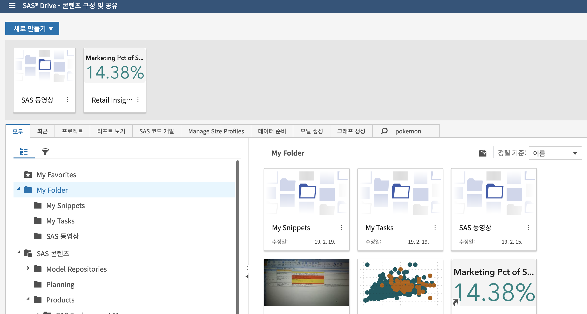

### 실습 1-2 초기화면 변경 하기

> 사용자 → 설정 → SAS Drive → 초기화면 

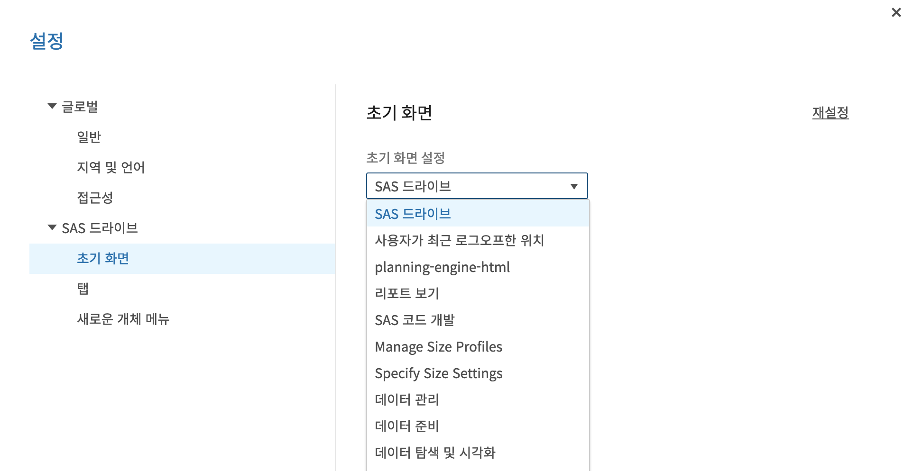

"데이터 탐색 및 시각화" 를 선택한뒤 "닫기"를 클릭 합니다. 로그아웃 한뒤 다시 로그인을 하고 초기 화면이 변경 되었는지 확인 합니다.

## 2. 데이터 준비

>데이타 준비 → 새로운 계획

### 실습 2-1 데이터 소스 선택

"CARS" 데이터셋 선택 후 <kbd>확인</kbd> 클릭

### 실습 2-2 컬럼 분할

"분할" 선택후 <kbd> 변환추가 </kbd> 클릭

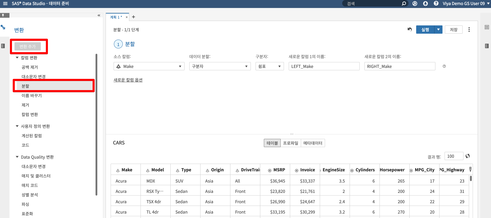

데이터 분할 : 고정길이, 고정길이 : 3 , 새로운 컬럼 1의 이름 : simple_make, 새로운 컬럼2의 이름 : delete_thing

으로 입력 한뒤 <kbd> 실행 </kbd> 클릭 

### 실습 2-3 대소문자 변경

"대소문자 변경" 선택 후 <kbd> 변환 추가 </kbd> 클릭. simple_make 컬럼을 대문자로 바꾸기 때문에 그대로 <kbd> 실행 </kbd> 클릭

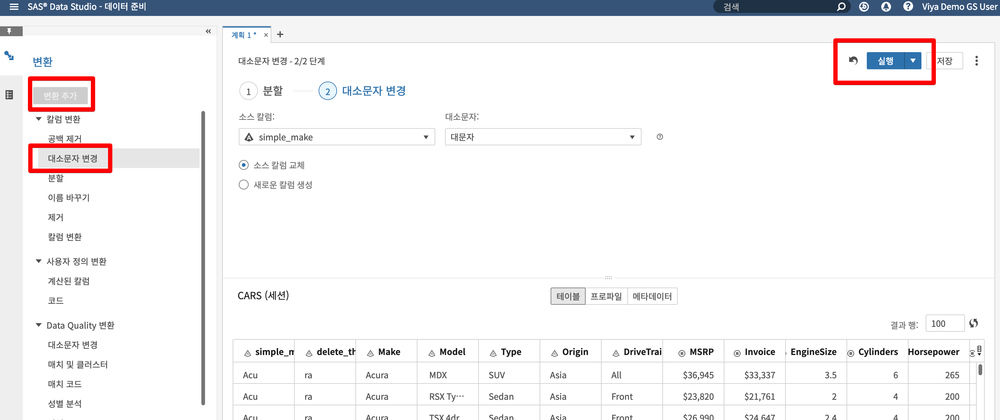

### 실습 2-4 계산된 컬럼 추가

"계산된 컬럼" 선택 후 <kbd> 변환추가 </kbd> 클릭

수식 영역에 소수점 을 제거 하는 **INT** 함수를 쓰고 **Horserpower** 를 **Cylinders** 갯수로 나누어 **Horsepower_per_Cylinders** 라는 신규 변수를 생성 한뒤 <kbd> 실행 </kbd> 을 클릭 합니다.

~~~
INT(Horsepower / Cylinders)
~~~

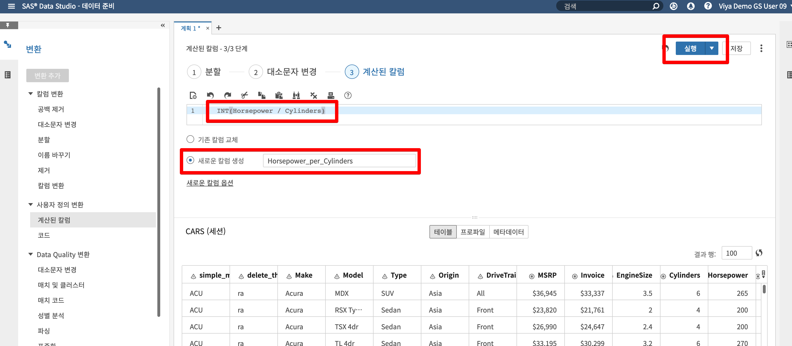

### 실습 2-5 컬럼 제거 하기

"제거" 선택 후 <kbd> 변환추가 </kbd> 를 클릭 합니다.

"소스 컬럼" 에서 **delete_thing" 을 선택하여 삭제 대상에 포함 시킨 후 <kbd> 실행 </kbd> 을 클릭 합니다.

<kbd> 저장 </kbd> 을 클릭 합니다.

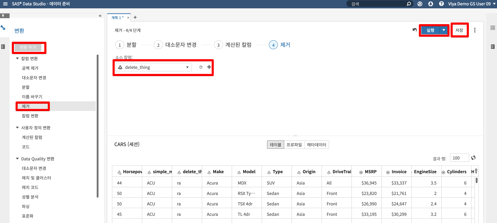

### 실습 2-6 플랜파일 또는 데이터 저장 하기

우측 상단에 있는 폴더 생성 아이콘을 클릭하여 **my_data** 라는 폴더를 생성 합니다.

"my_data" 폴더 선택 후 "이름" 항목에 "데이터정제 계획1" 로 입력 하고 "계획저장" 으로 선택한 후 <kbd> 저장 </kbd> 을 클릭 합니다. 

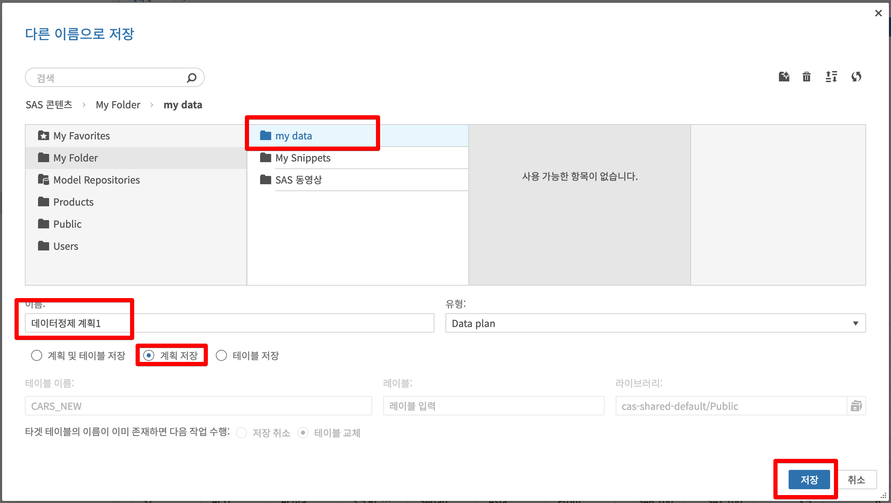

## 3. 데이터 시각화 

### 실습 3-1. 기본 그래프 그려보기

>데이터셋 : INSIGHT_TOY_DEMO

메뉴 에서 <kbd> 데이터 탐색 및 시각화 </kbd> 클릭 후 <kbd> 데이터 </kbd> 클릭 합니다.

데이터 소스 열기 화면이 아래와 같이 나타 나면 검색창에 "IN" 이라고 입력하면 **INSIGHT_TOY_DEMO** 테이블을 선택한 후 <kbd> 확인 </kbd> 을 클릭 합니다.

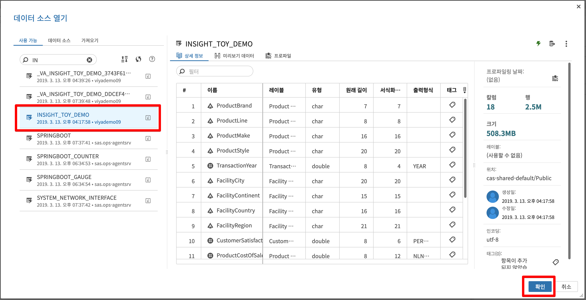

**LEFT PANE** 의 **개체 > 그래프** 에서 **이중 축 막대-선 그래프** 를 드래그 하여 CANVAS 에 옮겨다 놓습니다.

**RIGHT PANE** 의 **데이터 역할** 에서 아래와 같이 선택 합니다.

| 항목       | 선택 컬럼            |
| ---------- | -------------------- |
| 범주       | Transaction_Year     |
| 측도(막대) | Product Sale         |
| 측도(선)   | Product Matrial Cost |

**LEFT PANE** 의 **개체 > 컨트롤** 에서 **슬라이더** 와 **버튼** 을 각각 드래그 하여 그래프 상단에 아래와 같이 배치 합니다.

(슬라이더를 위쪽 / 버튼 아래쪽)

**슬라이더** 를 선택한 후 **RIGHT PANE** 의 **데이터 역할** 은 아래와 같이 설정 합니다.

| 항목      | 선택 컬럼        |
| --------- | ---------------- |
| 측도/날짜 | Transaction Year |

 **버튼** 을 선택한 후 RIGHT PANE 의 데이터 역할 을 아래와 같이 설정 합니다.

| 항목 | 선택컬럼           |
| ---- | ------------------ |
| 범주 | Facility Continent |

**RIGHT PANE** 의 **작업** 을 클릭하고 리스트 박스에서 **슬라이더 - Transaction Year 1** 을 선택 합니다.

**개체링크**  항목에서는 **버튼모음-Facility Continent1** 을 선택 합니다.

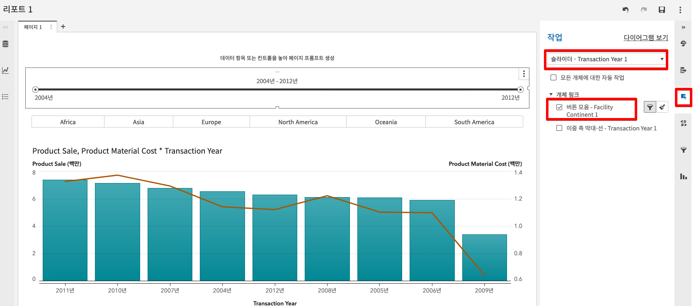

리스트 박스에서 **버튼 모음 - Facility Continent 1** 을 선택 합니다. **개체링크**  항목에서는 **이중 축 막대-선 - Transaction Year 1** 을 선택 합니다.

**막대선 그래프** 를 선택 한후 오른 쪽 마우스를 누르면 아래 화면 과 같이 팝업 창이 뜹니다.

**정렬 > Transaction Year: 오름차순 ** 을 선택 하면 아래와 같이 연도 시간 순으로 그래프가 정렬 됩니다.

**막대 그래프** 를 선택 한 후 **RIGHT PANE** 의 **옵션** 영역에서 아래와 같이 설정 합니다.

설정 후 그래프 모양이 이전보다 가독성이 좋아진 것을 확인 할 수 있습니다.

| 항목                            | 상세 설정       |
| ------------------------------- | --------------- |
| 선 > 데이터 레이블 **체크**     | 글자크기 **12** |
| 선 > 표식 **체크**              |                 |
| 막대 > 세그먼트 레이블 **체크** | 글자크기 14     |

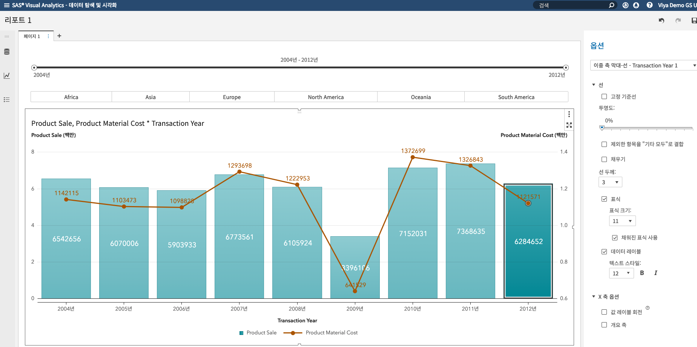

### 실습 3-2. 계층 데이터 만들기

> 데이터셋 : INSIGHT_TOY_DEMO

**새로운 페이지** 버튼을 클릭하여 새 페이지를 생성 합니다.

**LEFT PANE** 의 **데이터 > 새로운 데이터 항목 ** 을 클릭하여 새로운 계층 을 아래와 같이 만듭니다.

이름 항목에는 **GEO_CATEGORY** 로 입력 합니다.

각각 Facility Continent , Facility Country, Facility Region, Facility City 항목을 순서 대로 오른쪽의 **선택한 항목** 에 옮겨 둔 후 <kbd> 확인 </kbd> 을 클릭 합니다.

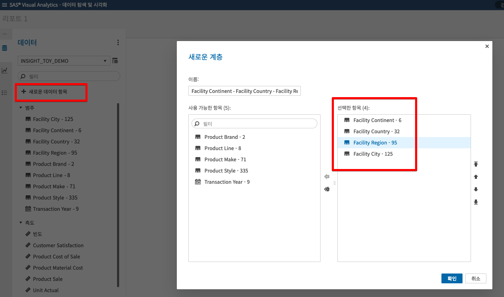

**막대 그래프** 를 선택 하고 **RIGHT PANE** 의 **데이터 역할** 에서 아래와 같이 설정 합니다.

| 항목 | 설정         |
| ---- | ------------ |
| 범주 | GEO_CATEGORY |
| 측도 | Product Sale |

막대 그래프에서 **North America** 를 클릭하면 상세 항목으로 드릴 다운 되는 것을 확인 할 수 있습니다.

### 실습 3-3. 교차 테이블(Pivot Table) 과 지리 정보 연계 하기

> 데이터셋 : INSIGHT_TOY_DEMO

**RIGHT PANE** 의 **옵션** 에서 아래와 같이 설정 합니다.

| 항목            | 상세설정                       |
| --------------- | ------------------------------ |
| **부분합** 체크 | 리스트 박스 에서 **컬럼** 선택 |
| 배경색          | **주황색** 선택                |
| 위치            | **뒤** 선택                    |

**Facility Continent** 항목에서 오른쪽 마우스를 클릭하면 아래와 같이 팝업이 뜨고, 이때 **Facility Continent 펼치기** 를 클릭하면 전체 대륙별 항목이 Drill Down 됩니다.

**LEFT PANE > 데이터 > 새로운 항목 > 지리항목** 을 클릭 합니다. 

 팝업 창이 뜨면 아래와 같이 새로운 지리 항목 2개를 생성합니다. (GEO_COUNTRY, GEO_CITY)

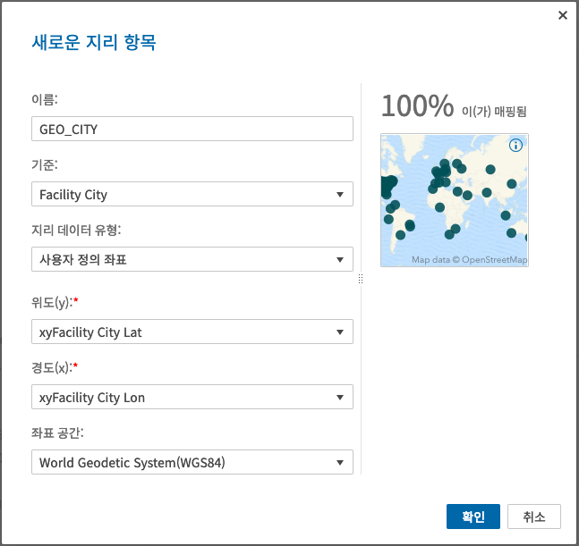

**LEFT PANE > 데이터 > 새로운 데이터 항목 > 계층 ** 을 클릭하여 새로운 계층 데이터를 만듭니다.

**LEFT PANE > 개체** 에서 **지도** 개체를 선책하여 **교차 테이블** 위쪽에 위치 시킵니다.

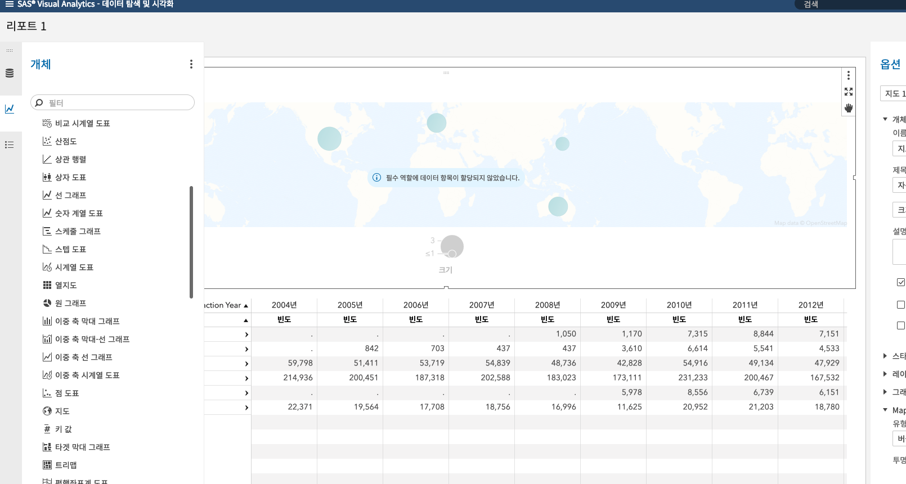

RIGHT PANE > 데이터 역할** 에서 아래와 같이 설정 합니다.

| 항목 | 설정         |
| ---- | ------------ |
| 범주 | GEO_LEVEL    |
| 크기 | Product Sale |

**RIGHT PANE > 작업** 에서 리스트박스 를 지도로 선택한뒤 **개체링크** 를 **교차테이블** 로 선택 합니다.

이제 지도를 더블 클릭하면 나라 범위에서 도시 범위로 확대가 되고 교차 테이블도 변화 하는것을 확인 할 수 있습니다.

### 실습 3-4. 데이터 뷰 및 데이터 조인

> 데이터셋 : PRDSAL3

데이터 뷰는 하나의 데이터셋을 보는 관점 입니다. 여러가지 데이터 뷰를 만들어 저장하고, 저장된 뷰는 다른 사용자와 공유 할 수 있습니다. 여러 명이 다양한 뷰를 공유 할 경우 **명명규칙** 을 정하여 일관되게 공유 하는 것이 좋습니다.

**LEFT PANE > 데이터 > 측도 ** 에서 **Actual Sales 및 Predicted Sales** 항목에 대한 집계 기준을 **평균** 으로 변경 합니다.

**LEFT PANE > 데이터 > 작업** 을 클릭 하면 아래와 같이 팝업이 트고, **데이터 뷰 저장** 을 클릭 합니다.

**이름** 항목에 **집계평균관점**이라고 입력한뒤 <kbd> 저장 </kbd>을 클릭 합니다.

해당 **데이터뷰** 는 데이터를 열었을때  기본 데이터 로 사용할 수 도 있고, 뷰를 다른 사용자와 공유 할 수 도 있습니다.

**LEFT PANE > 데이터 > 작업** 을 클릭하여 **데이터 뷰** 를 클릭하면 **집계평균관점** 이라는 뷰가 보입니다.

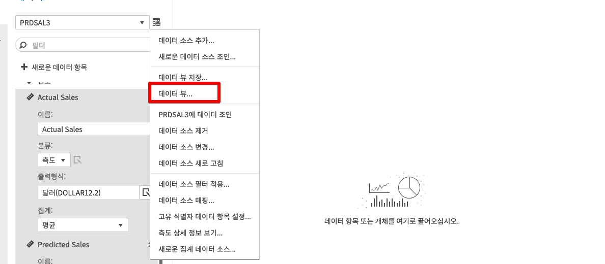

뷰를 불러오는 화면은 아래와 같습니다.

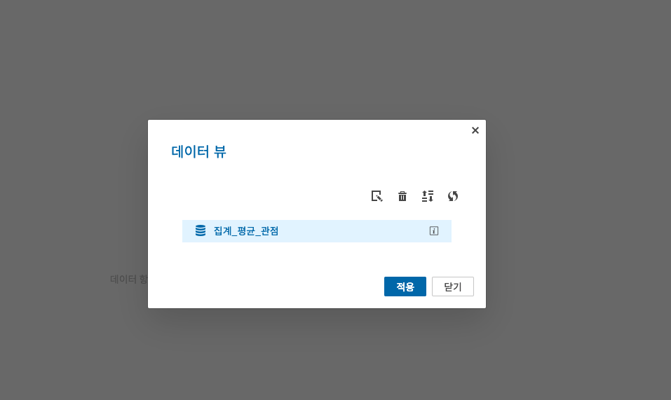

### 실습 3-5. 필터 / 규칙 / 순위 

> 데이터셋 : INSIGHT_TOY_DEMO

실습 3-1 에서 만든 그래프로 돌아 갑니다.

**RIGHT PANE > 표시규칙** 에서 아래 와 같이 **Product Sale** 항목이 5500000 을 넘을 경우 그래프를 붉은 색으로 변하게 설정 합니다.

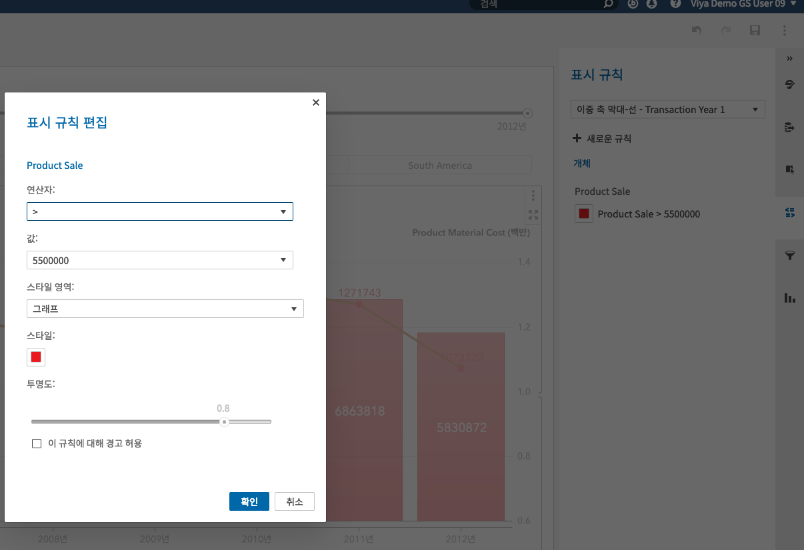

표시 규칙 편집 가장 아래 **이 규칙에 대해 경고 허용** 을 체크 해서 경고 를 전달 할 사용자를 선택 할 수 있습니다. 

**RIGHT PANE > 필터 > 새로운 필터 ** 에서 **Product Line** 을 선택 합니다.

**Product Line** 중 **Game** 을 제외 하도록 필터링 합니다. 체크 박스를 해지 하는 순간 그래프가 갱신 되는 것을 확인 할 수 있습니다.

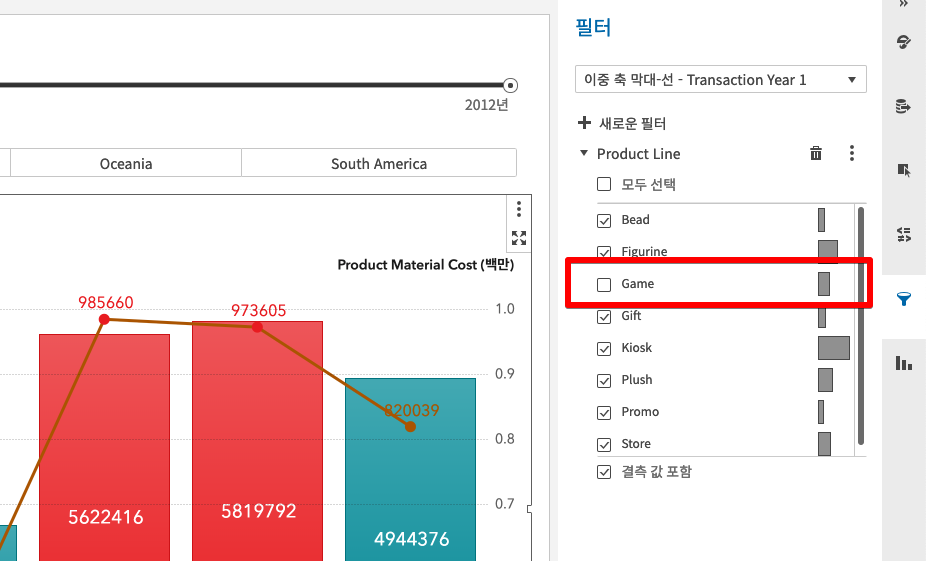

### 실습 3-6. 상관행렬

> 데이터셋 : HMEQ

새로운 페이를 생성 합니다.

**LEFT PANE > 데이터 > 작업 > 데이터 소스추가** 를 클릭 합니다.

검색 창에서 **HMEQ** 를 입력하면 아래와 같이 HMEQ_PREF_Q1 데이터셋이 나오면  <kbd> 확인 </kbd> 을 누릅니다.

**LEFT PANE > 데이터 > 측도** 에서 빈도를 제외한 모든 값을 <kbd>SHIFT</kbd> 키를 누른채 선택 하게 되면 모드 한꺼번에 선택 됩니다.

이후, 오른쪽 마우스 버튼을 클릭 하게 되면 팝업이 뜨고 **집계 > 평균** 으로 수정 합니다.

**LEFT PANE > 개체 > 상관 행렬** 을 선택 하여 CANVAS 에 옮겨 줍니다.

**RIGHT PANE > 데이터 역할 > 측도** 를 클릭하여 아래와 같이 <kbd>SHIFT</kbd> 키를 누른채로 BAD 와 YOJ 를 클릭하면 모두 선택 됩니다.

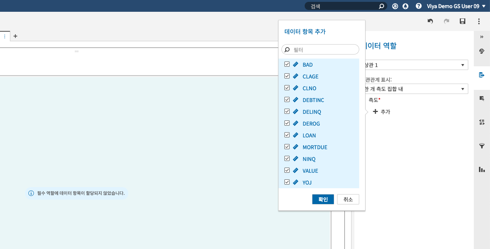

아래 화면과 같이 각각의 변수들의 상간 관계를 확인 할 수 있습니다. MORTDUE 와 VALUE 가 가장 큰 상관 관계를 보이고 있습니다. 참고로 HMEQ 데이터는 미국 주택 담보 대출 관련 채무자의 기록 입니다. 각각의 항목마다 대출금액, 자산, 신용조회 회수 등 다양한 개인신용 데이터 로 이루어져 있습니다. 

### 실습 3-7. WaterFall 차트 

> 데이터셋 : INSIGHT_TOY_DEMO

**LEFT PANE > 데이터 > 새로운 데이터 항목 > 계산된 항목 ** 클릭

아래와 같이 이름은 **margin** 으로 하고 **Product Sale** 에서 **Product Material Cost** 를 빼주도록 입력 합니다.

**LEFT PANE > 데이터 > 측도 > margin** 항목 에서 집계를 **평균** 으로 수정 합니다.

LEFT PANE > 개체 > Waterfall 그래프** 를 선택하여 CANVAS 에 옮겨 둡니다.

**RIGHT PANE > 데이터 역할** 의 내용을 아래와 같이 설정 합니다.

| 항목 | 설정값             |
| ---- | ------------------ |
| 범주 | Facility Continent |
| 측도 | margin             |

차트 에서 오른쪽 마우스 버튼을 클릭하여 아래와 같이 **margin:내림차순** 으로 정렬 합니다.

아래와 같이 대륙별 마진에서 아프리카에서 제품 당 가장 높은 마진을 남기는 것을 확인 할수 있습니다.

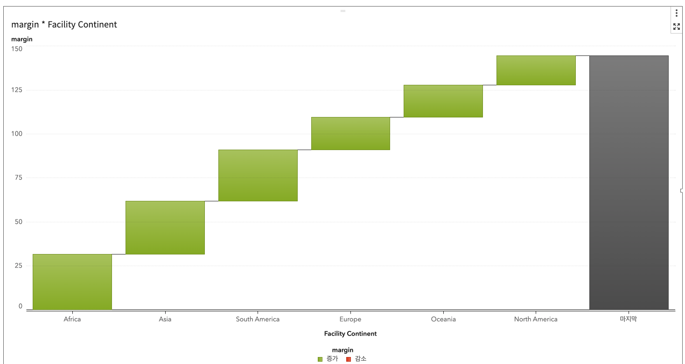

### 실습 3-8. ForeCast 사용하기

> 데이터셋 : FORECAST

**LEFT PANE > 개체 > 분석 > 예측** 을 선택하여 CANVAS 로 옮겨 둡니다.

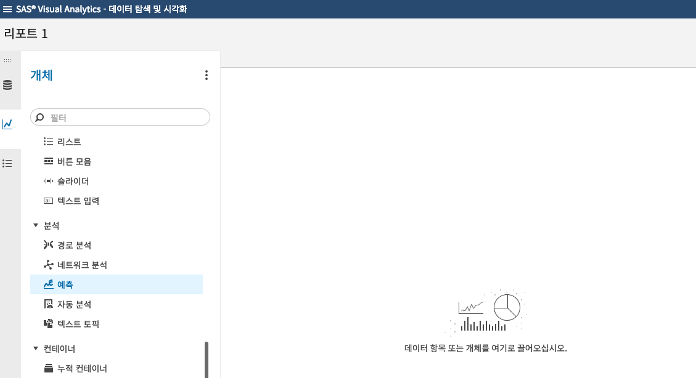

**RIGHT PANE > 데이터 역할** 을 아래와 같이 설정 합니다.

| 항목      | 설정                                  |
| --------- | ------------------------------------- |
| 시간축    | newdate                               |
| 측도      | Unit Sale                             |
| 기저 요인 | Unit Price, Unit Cost, Price Discount |

**RIGHT PANE > 데이터 역할 > 예측 > What if ** 를 클릭하여 목표값 찾기에서 ** 경계선 편집** 을 클릭합니다.

**기저요인** 항목중 **하한** **및 상한** 값을 아래와 같이 설정 한후 <kbd>닫기</kbd> 버튼을 누른 뒤 <kbd> 적용 </kbd> 버튼을 누르게 되면 예측이 바뀌는 것을 확인 할 수 있습니다.

**Waht if** 에서 **시나리오 분석** 을 선택 하게 되면 그래프를 마우스로 드래그 하여 조정 가능 할 뿐만아니라, 왼쪽 상단의 테이블 탭을 클릭하여 실제 항목 값을 조정 하여 분석 할 수 있습니다. 

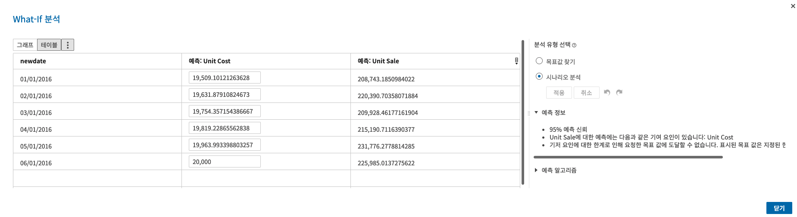

**RIGHT PANE > 옵션 > 예측 > 예측범위** 를 24 개월로 조정 하게 되면 예측의 범위가 커지게 됩니다.

### 실습 3-9. 컨테이너 사용하기

> 실습 3-10 에서 같이 수행

### 실습 3-10. 이미지를 이용한 페이지 디자인

> 데이터셋 : INSIGHT_TOY_DEMO

**SAS 콘텐츠에서 선택 ** 클릭 하게되면 아래와 같이 파일을 선택 할 수 있습니다.

**Public > GS > gs_image.png** 를 선택 한뒤 <kbd> 열기 </kbd> 를 클릭 합니다.

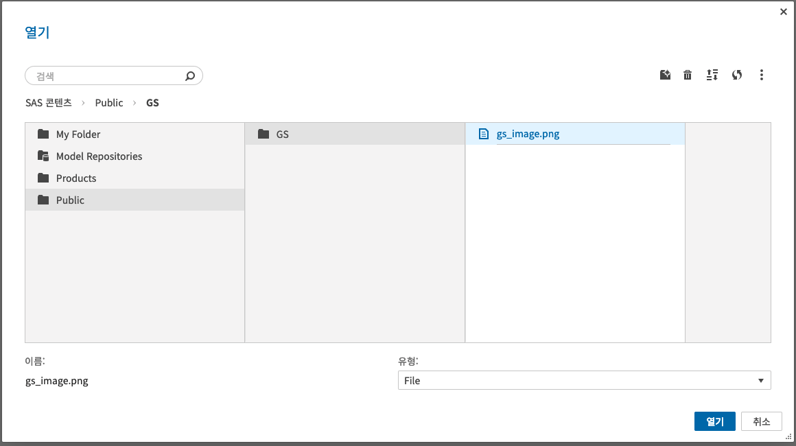

이미지를 최대한 가로로 확대 한 뒤, **RIGHT PANE > 옵션 > 배율유형** 을 **"늘이기"** 로 설정 합니다.

 

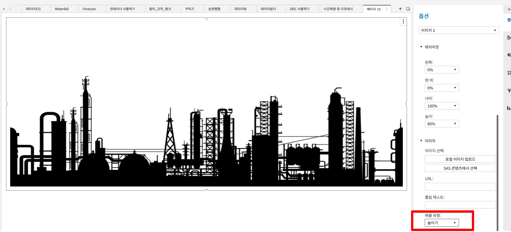

**LEFT PANE> 개체 > 그래프 > 시계열 도표 ** 를 선택하여 이미지 위에 위치 시키고 가로 넓이를 맞추어 줍니다.

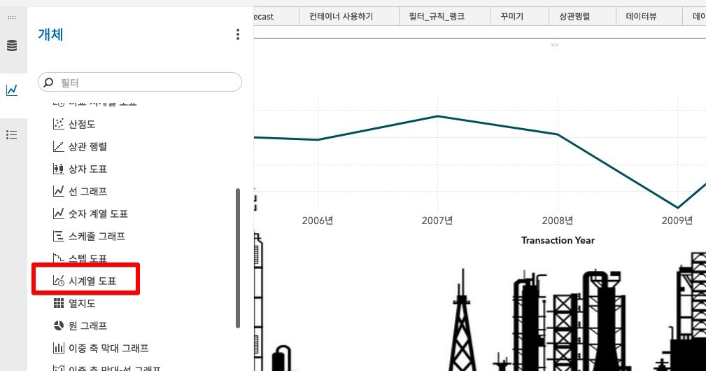

**RIGHT PANE > 데이터 역할** 에서 아래와 같이 설정 합니다.

| 항목   | 설정             |
| ------ | ---------------- |
| 시간축 | Transaction Year |
| 측도   | Product Sale     |

**RIGHT PANE > 옵션** 항목에서 글자 크기 및 색깔 등을 적당 하게 기호에 맞게 조정 하게 되면 아래와 같은 화면을 확인 할 수 있습니다.

### 실습 3-11. 데시보드 재생하기

### 실습 3-12. 데이타 빌더 사용하여 그래프 템플릿 생성 하기

### 실습 3-13. Data Driven Content 를 이용한 외부 차트 라이브러리 연계

>별도 자료로 제공됨 : [링크](https://github.com/dangtong76/sas-book/blob/master/posts/SAS_VisualAnalytics_Data_Driven_Content.md)

##  4. 리포트 공유

> 별도 자료로 제공됨 : [링크](https://github.com/dangtong76/sas-book/blob/master/posts/SAS_VA8.3_GUEST_Config.md)

## 5. R을 이용한 SAS 데이터 업로드 및 다운로드

> 별도 노트북 제공 : 

