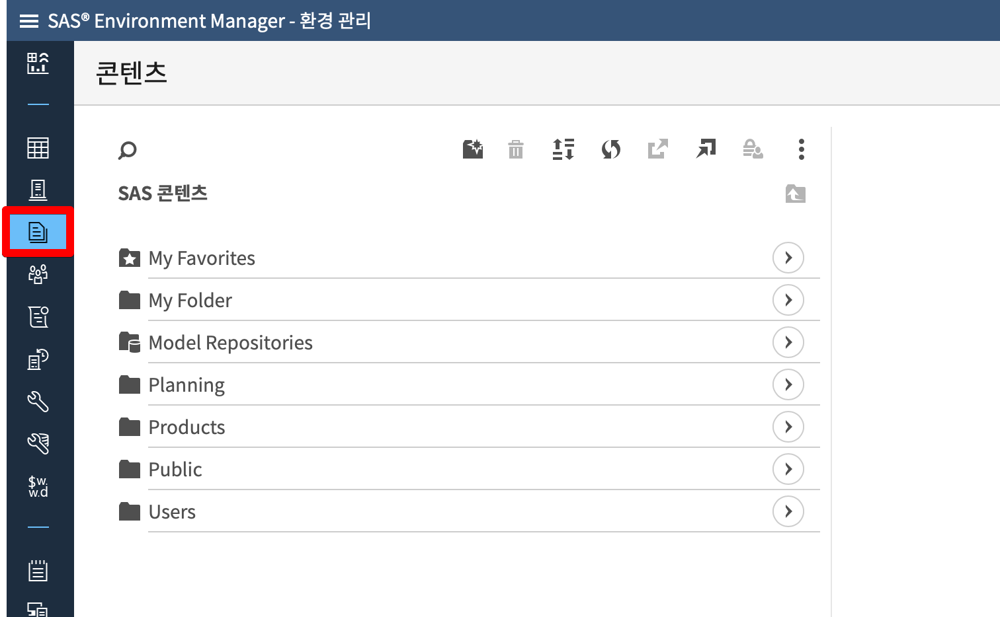
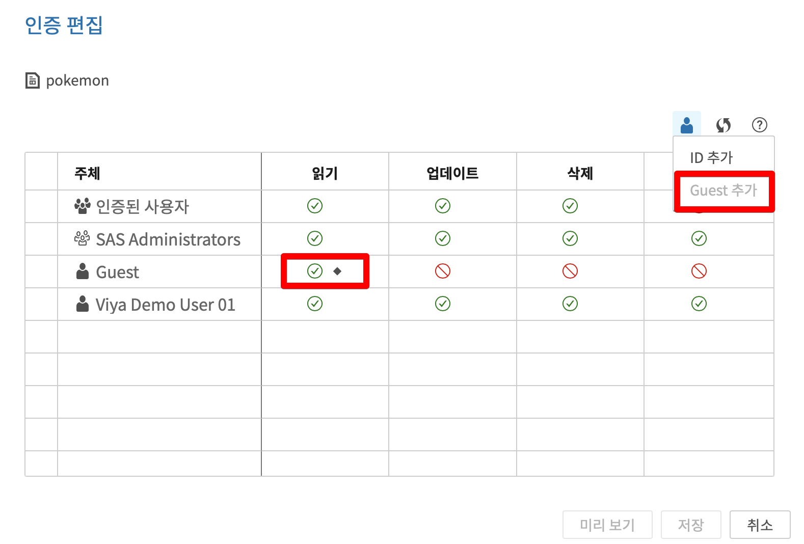
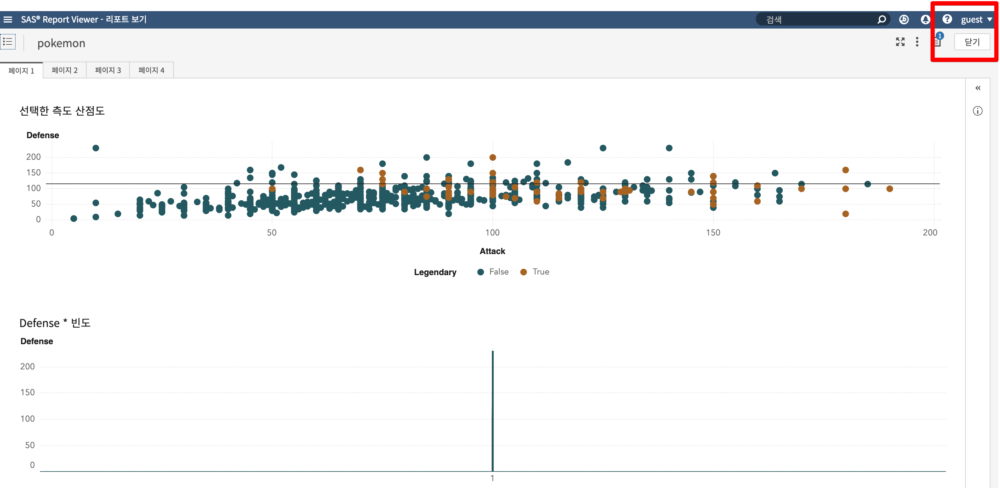

## VA8.3 리포트 연계시 로그인 없는 링크 제공 방법

로그인 없는 링크는 리포트 공유 뿐 아니라, 외부 사이트에 IFRAME 을 사용하여 리포트 EMBED 시에 유용하게 사용 할 수 있는 기능 입니다.

[TOC]

### 1. Configuration Manager 에서 Guest 계정 활성화

+ 환경 관리 > 구성 > 정의 > sas.logon.provider.guest 활성화 에서 "enabled" 활성화 시키기


### 2. sas-admin 명령을 이용한 인증관련 설정 변경

#### SSL 통신을 위한 인증서 설정

```bash
export SSL_CERT_FILE=/opt/sas/viya/config/etc/SASSecurityCertificateFramework/cacerts/trustedcerts.pem
```

#### sas-admin 인증을 위한 기본 프로파일 생성

```bash
[root@viyademo ~] sas-admin profile init
구성 옵션 입력:

서비스 끝점> https://viyademo.sas.com

출력 유형 (text|json|fulljson)> text
```

#### 기본 프로파일을 이용한 로그인

사용자 ID 는 VA 서버에 로그인 하는 사용자 ID 이며, Admin 권한이 있는 계정으로 입력 해야함

```
[root@viyademo ~] sas-admin auth login
https://viyademo.sas.com에 대한 자격 증명 입력:

사용자 ID> {viya-user-name}

암호> {viya-password}
로그인에 성공했습니다. 토큰이 저장되었습니다.
```

#### Guest Access 활성화

```
/opt/sas/viya/home/bin/sas-admin authorization facilitate-guest
```

#### Guest 계정의 디렉토리 생성

```bash
mkdir /opt/sas/viya/home/share/guest
chown -R sas:sas /opt/sas/viya/home/share/guest/
```

#### Guest 계정

~~~bash
sas-admin cas facilitate-guest --source-file  /opt/sas/viya/home/share/guest --server cas-shared-default --superuser
~~~

#### CAS 라이브러리에 대한 권한 부여 

~~~bash
/opt/sas/viya/home/bin/sas-admin cas caslibs add-control --server cas-shared-default --caslib PUBLIC --grant readInfo --guest --superuser

/opt/sas/viya/home/bin/sas-admin cas caslibs add-control --server cas-shared-default --caslib PUBLIC --grant select --guest --superuser

/opt/sas/viya/home/bin/sas-admin cas caslibs add-control --server cas-shared-default --caslib PUBLIC --grant limitedPromote --guest --superuser
~~~


### 3. 리포트 권한 편집

#### 인증편집







### 4. VA 리포트 편집에서 공유 대상 리포트 공유

#### 데이터탐색 및 시각화 > 리포트 공유 > 링크


#### "게스트 엑세스" 를 허용한 링크 복사

리포트에 대한 링크 생성시 아래 화면과 같이 "게스트 엑세스" 항목이 추가된 것을 확인 할 수 있습니다.


#### 로그아웃 후 새로운 창에 링크 붙여넣어 테스트 

Guest 계정으로 별도의 로그인 없이 리포트가 보이는 것을 확인 할 수 있습니다.




참고 : [GUEST 접속 관련 설정 온라인 메뉴얼](https://go.documentation.sas.com/?docsetId=calauthmdl&docsetTarget=n067qoyrgu1yohn19nq4ehy8o0b3.htm&docsetVersion=3.3&locale=en#p0jrliplx9dz0an11jdxlc7s15wq)


