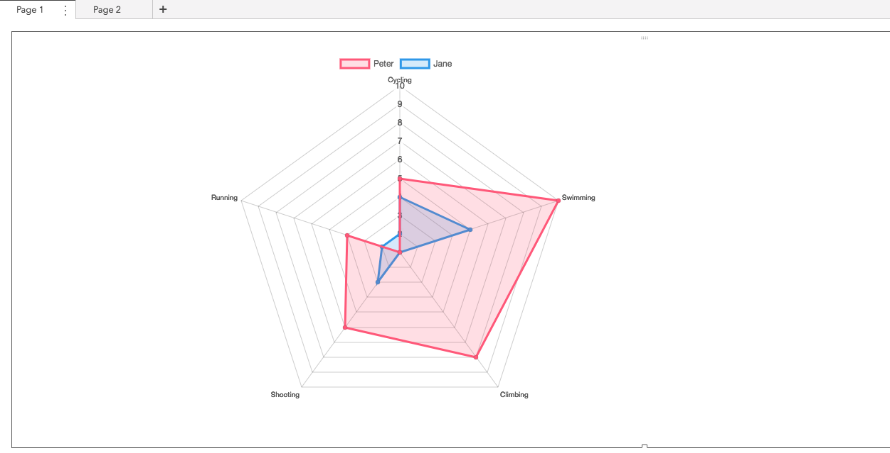
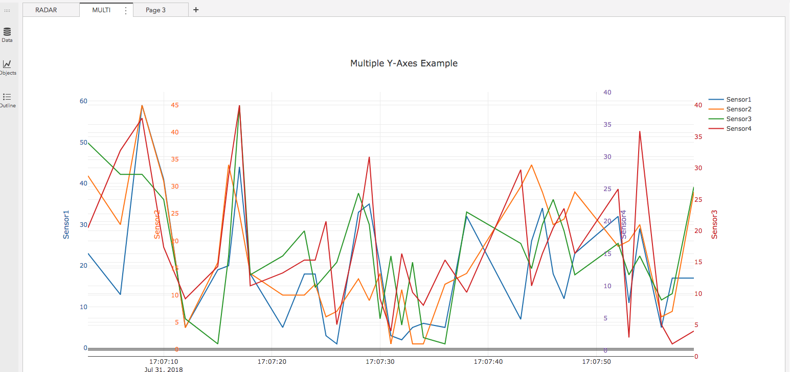

# SAS Visual Analytics Data Driven Contents(DDC) Guide

[TOC]

## 차트 구성 방법

SAS Visual Analytics 에서 제공하는 Data Driven Contents(DDC)는 외부 3rd Party 라이브러리를 참조하여 VA 에서 제공하지 않는 리포트 오브젝트를 만드는데 사용 합니다.

DDC 기능을 구현하는데 있는 크게 2가지 방법이 있습니다.

1. VA 서버내에 웹페이지를 Deployment 하여 구성하는 방법

2. VA 서버 외부의 웹서버에 웹페이지를 Deplymnet 하여 구성하는 방법

   > 외부 사이트의 웹사이트 내에 웹페이지와 연동시 반듯이 SSL(HTTPS) 통신으로만 연동이 됩니다.
   >
   > 따라서 외부 사이트가 SSL(HTTPS) 를 지원하는 웹서버 혹은 WAS 서버 여야만 합니다. 

본 가이드 에서는 **Chart.js** 의 RADAR 차트와 **Plot.ly** 의 multy Y 축 차트를 만드는 예제로 구성되어 있습니다.

##RADAR 차트

###DATA Set 업로드

다운로드(Dropbox) : [다운로드 클릭](https://www.dropbox.com/s/0kbfznvkq4uxxh4/star_data.csv?dl=1)

csv 파일을 다운로드 하여 CAS 테이블 생성

###VA 서버에 radar.html 업로드 하기

SAS VA 서버의 **/opt/sas/viya/home/var/www/html/htmlcommons**/ 디렉토에에 업로드

radar.html

~~~html
<HTML>
<head>
    
</head>

<BODY>
    

        <canvas id="myChart"></canvas>
    

</BODY>

</BODY>
</HTML>
~~~

###신규 리포트에 DDC 컴포넌트 추가 및 설정

1. Object Pane 에서 Other > Data-Driven Content 를 선택하여 Canvas 에 Drag&Drop 합니다.

2. 오른쪽 Options Pane 에서 Web Content > URL 부분에 

   http://{va-server-ip}/htmlcommons/radar.html 을 입력합니다.

   

3. 오른쪽 Roles Pane 에서 **Variables** 에 아이템을 추가 합니다.

> 아이템 추가 반듯이 unique 값인 id 컬럼도 추가 해야함

###결과 화면

##멀티 Y-축트차트

### DATA Set 업로드

다운로드(Dropbox) : [다운로드 클릭](https://www.dropbox.com/s/ttd7l84qz92wq3n/multi.csv?dl=1)

csv 파일을 다운로드 하여 CAS 테이블 생성

### VA 서버에 multi.html 업로드 하기

~~~html
<HTML>

<head>
    
</head>

<BODY>
    

</BODY>

</HTML>
~~~

###신규 리포트에 DDC 컴포넌트 추가 및 설정

1. Object Pane 에서 Other > Data-Driven Content 를 선택하여 Canvas 에 Drag&Drop 합니다.

1. 오른쪽 Options Pane 에서 Web Content > URL 부분에 

   http://{va-server-ip}/htmlcommons/multi.html 을 입력합니다.

   

2. 오른쪽 Roles Pane 에서 **Variables** 에 아이템을 추가 합니다.

> time, sensor1, sensor2, sensor3, sensor4 순서를 지켜 입력해야함

### 결과 화면

