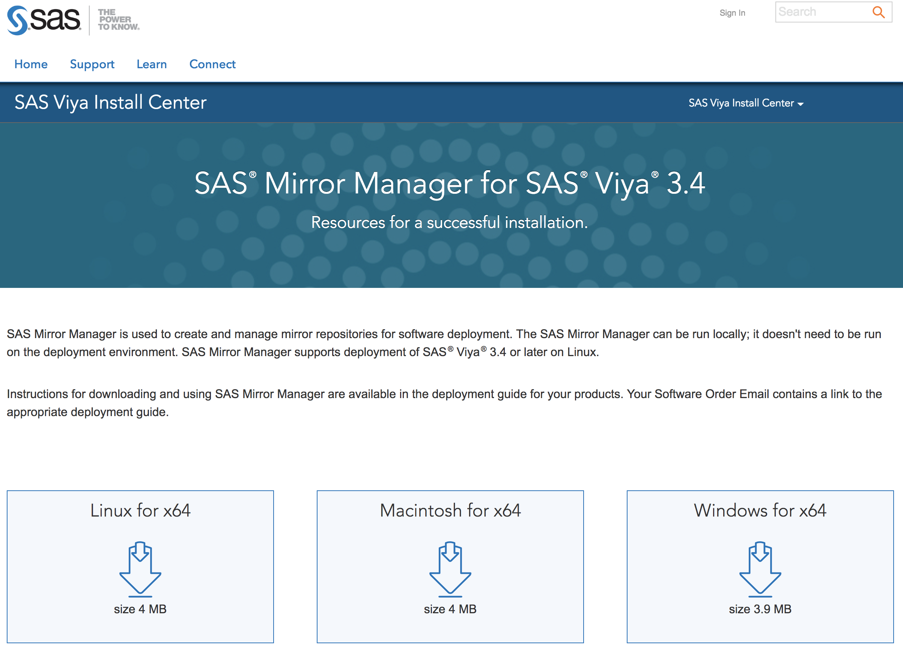

# SAS Viya Installation Guide for multi node

[TOC]

## 0. Viya 삭제

삭제시 자동으로 인스톨 디렉토리를 '_{sequence_number}'를 postfix 로 붙여 백업 하게 됩니다.

예를 들면 /opt/sas/viya 디렉토리는 /opt/sas/viya_{sequence_number} 로 변경 됩니다.

~~~{bash}
ansible-playbook deploy-cleanup.yml
~~~


## 1. 설치 사전 작업

### 1-1. 설치 환경

SAS Viya 설치 관련 내용은 아래와 같습니다.

SAS Viya 의 설치 이미지는 Viya3.4 부터 지원되는 mirror manager를 통해 다운받아 설치 하도록 합니다.

| 항목               | 내용                         |
| ------------------ | ---------------------------- |
| 설치 유저          | root                         |
| 설치 파일 위치     | /opt/install                 |
| SAS Viya 설치 위치 | /opt/sas/viya, /opt/sas/spre |

레드헷 리눅스의 경우 subscription 계약이 되어 있지 않다면, centos 리포지토리를 등록해서 Viya3.4 설치에 필요한 패키들을 다운 받을 수 있습니다.

vi /etc/yum.repository.d/centos.repo  

```
[base]
name=CentOS-$releasever - Base
baseurl=http://ftp.daum.net/centos/7/os/$basearch/
gpgcheck=1
gpgkey=http://ftp.daum.net/centos/RPM-GPG-KEY-CentOS-7

[updates]
name=CentOS-$releasever - Updates 
baseurl=http://ftp.daum.net/centos/7/updates/$basearch/
gpgcheck=1
gpgkey=http://ftp.daum.net/centos/RPM-GPG-KEY-CentOS-7

[extras]
name=CentOS-$releasever - Extras 
baseurl=http://ftp.daum.net/centos/7/extras/$basearch/
gpgcheck=1
gpgkey=http://ftp.daum.net/centos/RPM-GPG-KEY-CentOS-7

[centosplus]
name=CentOS-$releasever - Plus 
baseurl=http://ftp.daum.net/centos/7/centosplus/$basearch/
gpgcheck=1
gpgkey=http://ftp.daum.net/centos/RPM-GPG-KEY-CentOS-7

```


### 1-2. 유저 생성 및 디렉토리 생성

~~~bash
# 사용자 추가
useradd sas
useradd cas -g sas

# 인스톨 디렉토리 생성
mkdir -p /opt/install
chown -R sas:sas /opt
~~~


### 1-3. 설치시 필요 파일 리스트

아래 파일들을 다운 받아 ftp 접속이 가능한 유저의 디렉토리에 업로드 시킵니다.

| 파일명                       | 설명                                                     | 다운로드 링크                                                |
| ---------------------------- | -------------------------------------------------------- | ------------------------------------------------------------ |
| sas-orchestration-linux.tgz  | ansible playbook build (1-5 참조)                        | [다운로드](https://support.sas.com/en/documentation/install-center/viya/deployment-tools/34/command-line-interface.html) |
| mirrormgr-linux.tgz          | 설치 파일 다운로드 및 yum 로컬 리포지토리 구성 (1-6참조) | [다운로드](https://support.sas.com/en/documentation/install-center/viya/deployment-tools/34/mirror-manager.html) |
| SAS_Viya_deployment_data.zip | 라이센스 및 제품 목록 (1-4 참조)                         | 메일첨부                                                     |
| OpenLDAP-master.tar.gz       | 계정관리용 LDAP                                          | [다운로드](https://gitlab.sas.com/canepg/OpenLDAP) (SAS 네트워크) |


### 1-4. 파일 업로드

SOE (SAS Order Email) 에 첨부된 SAS_Viya_deployment_data.zip 파일을 다운받아 서버의 HOME  디렉토리에 업로드


### 1-5. SAS CLI 유틸리티 다운로드

[SAS Viya Command line Interface Utility](https://support.sas.com/en/documentation/install-center/sas-viya/deployment-tools/command-line-interface.html)  웹사이트 에서 운영체제에 맞는 CLI 다운로드

다운로드 대상파일 : sas-orchestration.tgz


### 1-6. Mirror Manager 다운로드 및 설정 (3.4 이상)

다운로드 : [Mirror Manager 다운로드](https://support.sas.com/en/documentation/install-center/viya/deployment-tools/34/command-line-interface.html)



온라인으로 다운 받으면서 설치 할 경우 시간이 매우 오래 걸리기 때문에 가급적 mirror manager 를 사용하여 다운을 받은뒤 리포지토리 구성을 해준후 설치 합니다. 미러 리포지토리는 아래 두가지 방법으로 모든 노들들에 공유 되어야 합니다.

1. NFS 를 이용하여 모든 노드에 마운트
2. 웹서버를 이용하여 모든 노드가 접근 가능 하도록 설정

Viya3.4 인스톨을 위해서는 모든 노드에 웹서버가 설치 되어야 하기때문에 2번 방법을 이용 하도록 하겠습니다.


#### Mirror Manager 압축풀기

~~~
gunzip mirrormgr-linux.tgz
tar -xvf mirrormgr-linux.tar
~~~


#### SAS 미러 리포지토리 만들기

명령어 : mirrormgr mirror --deployment-data {path-to-SOE-file} --path {mirror-path} --platform {platform-tag} --log-file {log-file-path} --latest

```
./mirrormgr mirror --deployment-data /home/ec2-user/SAS_Viya_deployment_data.zip --path /opt/install/mirror --platform x64-redhat-linux-6 --log-file /home/ec2-user/mirrormgr.log --latest
```

다운받은 미러 리포지토리는 웹서버나 NFS를 이용해서 모든 노드에서 리포지토리로 인식 가능 합니다.

하지만 추가적인 웹서버가 없거나 NFS 와 같은 공유 파일 시스템이 없을경우 해당 디렉토리를 tar 로 묶어 모든 노드의 동일한 디렉토리에 구성합니다. 본 가이드에서는 모든 서버의 /opt/install/mirror 디렉토리에 리포지토리를 구성하였습니다.

~~~
cd /opt/install
tar -cvf mirror.tar ./mirror
~~~

tar 로 압축한 파일을 scp, rsync ftp 등을 이용해서 다른 노드의 동일한 디렉토리에 전송하고 압축을 풉니다.

#### Hostname 변경

FQDN을 따르지 않는 모든 노드의 호스트네임을 변경합니다. 예를 들어, "www"가 호스트 이름이고, "mycompany.co.kr"이 도메인 이름이라면, FQDN은 "mycompany.co.kr"가 됩니다. 

> 도메인 서버 등록과 상관없이 내부망 에서는 /etc/hosts 파일에만 등록하면 도메인에 우선 합니다. 

명령어 : hostnamectl set-hostname {host-name}

~~~bash
hostnamectl set-hostname casc.mycompany.com  #controller node
hostnamectl set-hostname casw1.mycompany.com #cas worker node1
hostnamectl set-hostname casw2.mycompany.com #cas worker node2
hostnamectl set-hostname casw3.mycompany.com #cas worker node3
~~~


#### Hostname 을 각 노드의 /etc/hosts 파일에 등록

~~~
192.168.56.101 casc.mycompany.com
192.168.56.102 casw1.mycompany.com
192.168.56.103 casw2.mycompany.com
192.168.56.104 casw3.mycompany.com
~~~

> 웹서버 설치 전에 호스트 파일을 먼저 변경 하는 것은 웹서버 인증서가 호스트 파일 을 기본으로 생성 되기 때문입니다.
>
> 웹서버 설치후에 호스트 파일을 변경하게 되면 Viya설치시 에러가 발생 합니다. 이때는 mod_ssl 을 삭제하고 재설치 하면 새로운 호스트 파일의 이름으로 인증서를 만들게 되고 이후 새롭게 viya 를 설치 하면 됩니다.


### 1-7 Ansible Playbook 생성

####  JDK 설치

Ansible playbook 을 생성을 위해 sas-orchestration 명령어를 사용하게 되며, 명령어 수행을 위해 jdk 인스톨이 필요합니다.

SAS Viya 에서는 아래 두가지 JDK 를 권장합니다.

1. OpenJDK 1.8.x 이상
2. OracleJDK 1.8.x 이상
3. Azul zulu version 1.8.x 이상

> OpenJDK7 이상 부터는 Oracle Idk 와 성능 차이가 거의 없으며 안정성 또한 많은 상용기업에서 사용하고 있기 때문에 문제가 되지 않습니다. 

~~~bash
yum install java-1.8.0-openjdk
~~~


#### Ansible Playbook 생성

Ansible 을 통해 Viya3.4 설치를 위해 ansible-playbook 을 생성 합니다. SOE 메일에 적힌 라이센스 허가 목록에 대해서만 Ansible playbook이 자동 생성 됩니다.

```
# 압축 풀기
gunzip sas-orchestration.tgz
tar -xvf sas-orchestration.tar

# Ansible Play Book 생성
./sas-orchestration build --input /home/ec2-user/SAS_Viya_deployment_data.zip --repository-warehouse "file:///opt/install/mirror" --platform redhat

# 플레이북 파일 install 디렉토리로 이동
cp SAS_Viya_playbook.tgz /opt/install/

# 플레이북 압축 풀기
cd /opt/install
tar -xvf SAS_Viya_playbook.tgz
```

> Platform TAG 정보는 oracle linux , redhat linux 의 경우 **redhat**, 수세리눅스의 경우 **suse**
>


### 1-8. SSH 키생성 및 복사

#### root 유저 키생성

ssh key 를 생성하게 되면 /root/.ssh 디렉토리 밑에 id_rsa(개인키), id_rsa(공개키) 가 만들어 집니다.

~~~bash
ssh-keygen -t rsa -N "" -f ~/.ssh/id_rsa
~~~

#### ssh 키복제를 위한 sshd 데몬 설정 및 재가동

/etc/ssh/sshd_config 열어서  PasswordAuthentication 을 yes 로 변경(no 부준을 주석처리)

~~~bash
PasswordAuthentication yes
#PermitEmptyPasswords no
#PasswordAuthentication no
~~~

#### sshd 데몬 재가동

~~~
systemclt restart sshd
~~~


#### root 유저 키복사

터미널창 4개를 열어서 동시전송으로 차례대로 4개를 입력합니다. 패스워드를 물어보면 입력합니다.

~~~
ssh-copy-id casc.mycompany.com
ssh-copy-id casw1.mycompany.com
ssh-copy-id casw2.mycompany.com
ssh-copy-id casw3.mycompany.com
~~~


#### sshd 설정원복

/etc/ssh/sshd_config 열어서  PasswordAuthentication 을 yes 로 변경(no 부준을 주석처리)

```bash
#PasswordAuthentication yes
#PermitEmptyPasswords no
PasswordAuthentication no
```


#### sshd 데몬 재가동

```
systemclt restart sshd
```


## 2. 요구 Package 설치 및 OS 설정 변경(튜닝)

### 2-1. epel YUM Repository 추가

Peel 리포지토리의 경우 redhat 및 기본 리포지토리에 python-pip 등의 python 관련 패키지가 포함되어 있지 않기 때문에 반듯이 추가 하여야 합니다.

yum install -y https://dl.fedoraproject.org/pub/epel/epel-release-latest-${majversion}.noarch.rpm

~~~bash
yum install -y https://dl.fedoraproject.org/pub/epel/epel-release-latest-7.noarch.rpm
~~~

> $majversion 에 리눅스 버전 추가 
>
> redhat 7.4 일경우 $majversion 은 7


### 2-2 요구 소프트웨어 설치

````
# 운영체제 확인
cat /etc/*-release

m
# sudo 권한 확인
sudo -v

# systemd 버전확인 (219 ~230버전)
rpm -qa systemd

# 필요하면 systemd 업데이트
yum update systemd

# HTTPD 확인
service httpd status

# 필요시 HTTPD 설치
yum install httpd

# Viya3.4 설치를 위한 요구 패키지 설치 스크립트 .sh 파일로 저장한후 실행 하면 자동 설치 됩니다.
pkgs="                    \
 at                       \
 nfs-utils.x86_64         \
 nfs-utils-lib.x86_64     \
 gcc                      \
 glibc                    \
 firefox                  \
 compat-libstdc++-33      \
 compat-glibc             \
 GLIBC 2.12               \
 libuuid                  \
 libSM                    \
 libXrender               \
 fontconfig               \
 libstdc++                \
 zlib                     \
 apr                      \
 ksh                      \
 numactl                  \
 perl-Net-SSLeay          \
 libXext                  \
 libXext.i686             \
 libXp                    \
 libXp.i686               \
 libXtst                  \
 libXtst.i686             \
 libgcc                   \
 libgcc.i686              \
 libpng12                 \
 libpng12.i686            \
 python 2.7               \
 xterm                    \
 xauth                    \
 libXmu                   \
 uuid                     \
 mod_ssl                  \
 tcl                      \
"
yum install  $pkgs -y

# 방화벽 중단
service firewalld stop
systemctl disable firewalld.service

# Selinux 중단
sestatus 
#만약 활성화 상태일 경우 모든 타겟 서버에 다음 명력을 통해 permissive mode 를 활성화 함

setenforce 0
sed -i.bak -e 's/SELINUX=enforcing/SELINUX=permissive/g' /etc/selinux/config

# epel 이 제대로 추가 되었는지 확인
sudo yum repolist

# root 계정으로 /opt 하위에 sas/cascache 디렉토리 생성. 
# cascache 디렉토리에 chmod 777 cascache 명령어를 통해 권한 부여 
mkdir -p /opt/sas/cascache
chmod 777 /opt/sas/cascache
````


### 2-3 Ansible 설치

+ Ansible 설치를 위한 패키지 설치

~~~bash
yum install -y python python-setuptools python-devel openssl-devel
yum install -y python-pip gcc wget automake libffi-devel python-six
~~~

+ Epel 삭제

~~~
yum remove -y epel-release
~~~

+ PIP 업그레이드

redhat linux 6.x 대

~~~
pip install --upgrade pip==9.0.3
~~~

redhat linux 7.x 대

~~~
pip install --upgrade pip setuptools
~~~


+ Ansible 설치

~~~
pip install ansible==2.5.3
~~~

+ 설치 확인

~~~
ansible --version
ansible localhost -m ping
~~~


### 2-4 커널변수 튜닝

아래 튜닝 항목들은 운영을 위한 최소 튜닝 방법 이므로 추가적은 성능 튜닝은 [SAS Viya 튜닝 가이드](http://documentation.sas.com/api/docsets/caltuning/3.4/content/caltuning.pdf?locale=en)를 참조 바랍니다.

+ /etc/ssh/sshd_config 파일 수정

~~~
MaxStartups 100
MaxSessions 100
~~~

+ /etc/security/limits.conf 파일 수정

~~~
*	soft	nproc	100000
*	hard	nproc	100000
*	soft	nofile	350000
*	hard	nofile	350000
*	soft	stack	10240
*	hard	stack	32768
sas	-	nofile	150000
*	-	nofile	150000
sas	-	stack	10240
~~~

+ /etc/security/limits.d/20-nproc.conf 파일 수정

~~~bash
*          soft    nproc     150000
root       soft    nproc     unlimited
*       -       nproc   100000
~~~

+ /etc/sysctl.conf 파일 수정

~~~
kernel.shmmni = 4096
kernel.sem = 512 32000 256 1024
net.core.somaxconn = 2048
net.ipv4.ip_local_port_range = 9000 65500
net.core.rmem_default = 262144
vm.max_map_count=262144
vm.overcommit_memory=0
~~~

+ 설정 변경 확인

~~~
sysctl -p
~~~

+ /etc/systemd/system.conf 파일 수정

~~~
DefaultTimeoutStartSec=1800s
DefaultTimeoutStopSec=1800s
~~~

### 2-5 hostname 확인

아래 호스트네임 명령 3가지 를 수행해서 나온 결과가 모두 같아야 합니다.

~~~
hostname
hostname -f
hostname -s
~~~


## 3.Installation

### 3-1 검증 및 인스톨

/opt/install/sas_viya_playbook 경로에서 다음 명령어 수행

~~~
cp samples/inventory_cas_multi_machine.ini inventory.ini
~~~

 inventory.ini 를 아래와 같이 편집합니다.

> 하나의 노드(장비) 에 대해 서로 다른 Alias 명을 사용하지 마십시요. 아래와 같이 모든 노드들이 서로다른 Alias 명을 가지고 있습니다. 

~~~
[host-definitions]
deployTarget ansible_connection=local internal_deployment_ipv4_override=192.168.56.101 self_deployment_ipv4_override=192.168.56.101 consul_bind_adapter=eth0

casw1 ansible_host=casw1.mycompany.com ansible_user=root ansible_ssh_private_key_file=~/.ssh/id_rsa self_deployment_ipv4_override=192.168.56.102 internal_deployment_ipv4_override=192.168.56.102 consul_bind_adapter=eth0

casw2 ansible_host=casw2.mycompany.com ansible_user=root ansible_ssh_private_key_file=~/.ssh/id_rsa self_deployment_ipv4_override=192.168.56.103 internal_deployment_ipv4_override=192.168.56.103 consul_bind_adapter=eth0

casw3 ansible_host=casw3.mycompany.com ansible_user=root ansible_ssh_private_key_file=~/.ssh/id_rsa self_deployment_ipv4_override=192.168.56.104 internal_deployment_ipv4_override=192.168.56.104 consul_bind_adapter=eth0

[sas-casserver-primary]
deployTarget

[sas-casserver-worker]
casw1
casw2
casw3
~~~


### 3-2 vars.yml  수정

~~~BASH
# vi /opt/sas/install/sas_viya_playbook/vars.yml 를 입력하여 파일을 연 후 적절한 DEPLOYMENT_LABEL 을 설정
DEPLOYMENT_LABEL : "{{ DEPLOYMENT_ID}}"

# sas_install_type 설정. default 설정은 all 이며 모든 소프트웨어를 설치. 
# programming 옵션 설정 시 CAS, SAS Foundation, SAS Studio를 포함한 programming interface만 설치
sas_install_type : all

# casenv_group 값을 cas가 속해 있는 그룹의 이름으로 설정
casenv_group : sas

# Full Deployment를 위하여 LDAP user를 cas admin user로 설정. casenv_admin_user의 값을 주석 해제 후 해당하는 user 이름으로 값 설정.
casenv_admin_user : cas

# CAS_DISK_CACHE를 주석 해제 후 /opt/sas/cacscache 로 경로 설정
CAS_DISK_CACHE : /opt/sas/cascache
~~~


### 3-3 Validation 수행

/opt/sas/install/sas_viya_playbook/  에서 아래 명령어 수행

~~~bash
ansible-playbook system-assessment.yml 
~~~


### 3-4 Deployment 수행

/opt/sas/install/sas_viya_playbook/  에서 아래 명령어 수행

~~~
# 일반적인 방법
ansible-playbook -vvv site.yml

# 백그라운드 수행
nohup ansible-playbook -vvv site.yml &
~~~

> 백그라운드로 수행할 경우 deployment.log 및 nohup.out 을 확인하면 인스톨 상황을 알 수 있음


### 3-5 설치 모니터링 스크립트

~~~bash
while [ 1 ]
do 
	cat deployment.log | grep '"failed": true' 
	sleep 2
	clear
done
~~~

~~~bash
while [ 1 ]
do
cat yum.log | grep sas- | grep Installed | wc -l
sleep 2
done
# yum 로그를 통해 진행 정도를 알 수 있습니다. 
# Full 버전 설치시 : 640여개
# VA 설치시
# VA + VS 설치시
# VA + VS + VDMML 설치시
~~~


## 4. OpenLdap 설치 및 연동


## 5. Viya 서비스 기동시 순서

Viya 시스템에 대한 시작 및 중지 시에는 아래 내용을 기준으로 수행 합니다.

### 5-1. SAS Configuration Server 및 Agent Start

프라이머리 노드에서 먼저 수행하고 나머지 노드 들에 대해 수행합니다.

~~~bash
# Redhat Linux 6
service start sas-viya-consul-default start
~~~

~~~bash
# Redhat Linux 7
systemctl start sas-viya-consul-default start 
~~~


### 5-2. Vault(Secret Manager) 서비스 Start

해당 서비스가 존재하는 노드에 대해 수행합니다. (일반적으로 Primary node)

~~~bash
# Redhat Linux 6
service start sas-viya-vault-default
~~~

~~~bash
# Redhat Linux 7
systemctl start sas-viya-vault-default
~~~


### 5-3. Message Broker 서비스 Start

해당 서비스가 존재하는 노드에 대해 수행합니다. (일반적으로 Primary node)

~~~bash
# Redhat Linux 6
service start sas-viya-rabbitmq-server-default
~~~

~~~bash
# Redhat Linux 7
systemctl start sas-viya-rabbitmq-server-default
~~~


### 5-4. Data Server Service Start

~~~bash
# Redhat Linux 6
service start sas-viya-sasdatasvrc-postgres
~~~

~~~{bash}
# Redhat Linux 7
systemctl start sas-viya-sasdatasvrc-postgres
~~~


### 5-5. Httpd 서비스 Start

~~~{bash}
# Redhat Linux 6
service start httpd
~~~

~~~{bash}
# Redhat Linux 7
systemctl start httpd
~~~


### 5-6. 기타 서비스 모두 Start

~~~bash
# Redhat Linux 6
service start sas-viya-all-services
~~~

~~~{bash}
# Redhat Linux 7
systemctl start sas-viya-all-service
~~~


###  

## 부록

### 부록-1 Oracle Access

### 부록-2 Hadoop Access

### 부록-3 Hadoop EP 설치 및 연결

###부록-3 Amazon Redshift