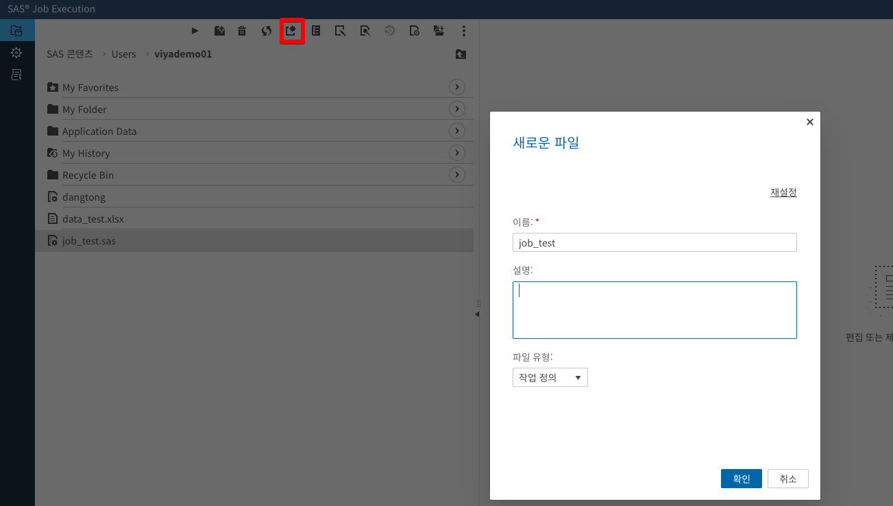
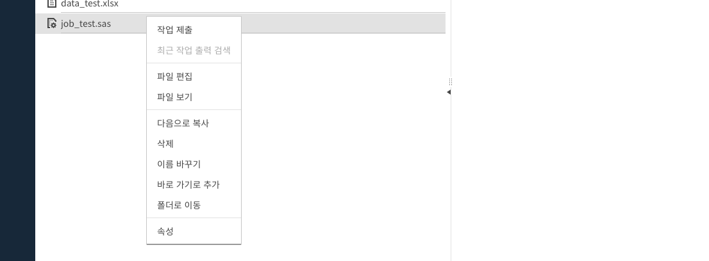
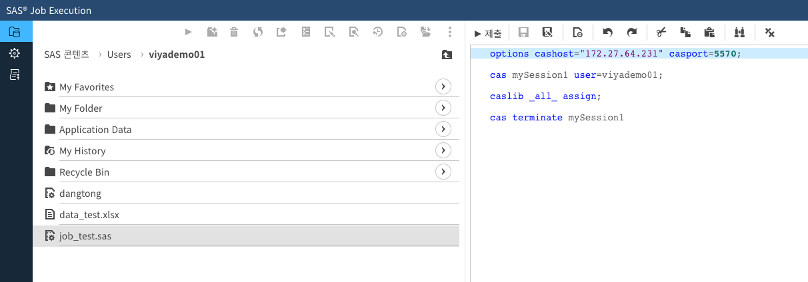
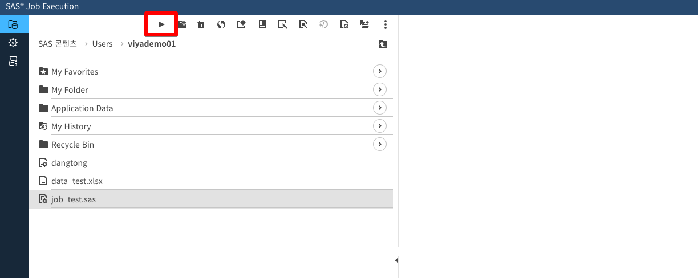
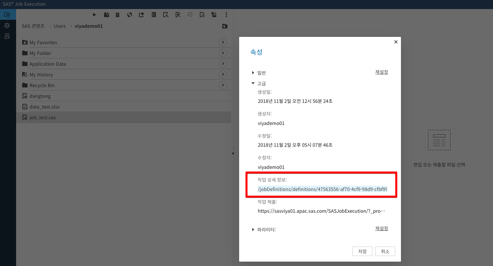

## SAS Viya REST API 를 통한 프로그램 수행 가이드

[TOC]

### 인증 관련 가이드

REST API 를 수행하기 위해 인증받는 부분은 아래 가이드를 참조 바람

[REST API 인증가이드](https://github.com/dangtong76/sas-book/blob/master/posts/REST_API_Authentication.md)

### POSTMAN 샘플

POSTMAN 에 아래 파일을 Import 하여 url 의 서버 주소만 바꿔서 수행 할 수 있습니다. 인증부터 작업 확인 까지 구성 되어 있습니다.

[POSTMAN 샘플 다운로드](https://github.com/dangtong76/sas-book/blob/master/file/SAS_Viya_JOB_REST.postman_collection.json)

### 작업 수행 플로우

프로그램을 SAS Viya 의 JOB 으로 등록 하고 수행하기 위한 전체 적인 프로세스는 아래와 같습니다.

### 웹콘솔 에서 작업 등록 생성

작업 등록과 관련한 좀더 자세한 사항은 [메뉴얼](<https://go.documentation.sas.com/?docsetId=jobexecug&docsetTarget=n055josnxfatfwn1pyr7p1ah7225.htm&docsetVersion=2.0&locale=ko>) 을 참조 하십시요.

#### 1. JOB 정의

##### 콘솔 접속

<http://viyaserver/SASJobExecution> 접속 후 Users > 계정 선택

#### 2. JOB에 대한 코드 생성

새로운 파일 생성하여 파일 이름을 지정 합니다.

생성된 파일에 오른쪽 마우스 버튼을 클릭하여 "파일 편집" 을 선택 합니다.

수행될 코드를 입력 합니다.

#### 3. JOB 수행 확인

프로그램을 선택 하고 "수행" 버튼을 누릅니다. 작업이 정상적으로 수행 되는 지 확인 합니다.

#### JOB ID 확인 하기

프로그램을 선택하여 오른쪽 마우스 버튼을 클릭 후 "속성" 을 클릭합니다.

속성 보기 에서 "고급" 을 클릭하여 JOB ID(숫자 부분) 를 기억 또는 복사 해 둡니다.

### REST API 를 통한 작업 호출

웹콘솔을 통해 등록 한 SAS 프로그램을 수행 하기 위해서는 위에서 조회한 JOB ID 를 바탕으로 "작업 정의" 를 조회 해야 합니다.

#### 1. 등록 대상 JOB 정의(Definition) 조회

##### URL

| 항목   | 내용                                                      | 기타 |
| ------ | --------------------------------------------------------- | ---- |
| URL    | http://{sas-viya-url}/jobDefinitions/definitions/{job_id} |      |
| METHOD | GET                                                       |      |

##### 부가정보

| 항목   | KEY           | VALUE                                   | 기타 |
| ------ | ------------- | --------------------------------------- | ---- |
| HEADER | Authorization | Bearer {Access_Token}                   |      |
| HEADER | Accept        | application/vnd.sas.job.definition+json |      |

#### 2. 작업 요청서 등록

작업을 수행하기 위해 작업 요청서를 작성 합니다. 한번 만들어진 작업 요청서는 서버에 보존 되며, 수정 및 삭제 가 REST 를 통해 가능 합니다. 

##### URL

| 항목   | 내용                                           | 기타 |
| ------ | ---------------------------------------------- | ---- |
| URL    | http://{sas-viya-url}/jobExecution/jobRequests |      |
| METHOD | POST                                           |      |

##### 부가정보

| 항목   | KEY           | VALUE                                              | 기타 |
| ------ | ------------- | -------------------------------------------------- | ---- |
| HEADER | Authorization | Bearer {Access_Token}                              |      |
| HEADER | Accept        | application/vnd.sas.job.execution.job.request+json |      |
| HEADER | Content-Type  | application/json                                   |      |
| BODY   |               | 아래 참조                                          |      |

##### BODY

아래 항목중 "< >" 로 지정된 부분에 적당한 내용 입력

~~~
{
            "creationTimeStamp": "<생성시간 예: 2018-08-12T00:11:42.515Z>",
            "modifiedTimeStamp": "<수정시간 예: 2018-08-12T00:11:42.515Z>",
            "createdBy": "<작업수행 계정 예:viyademo01>",
            "modifiedBy": "<작업수행 계정 예:viyademo01>",
            "version": 3,
            "id": "",
            "name": "<사용자가 지정하는 작업명 예:job_test2>",
            "description": "",
            "jobDefinition": {<1에서 조회한 JOB Definition 을 그대로 입력>}
            ,
            "arguments": {
                "_userlocale": "ko",
                "_omitTextLog": "true",
                "_clientname": "SASJobExecution",
                "_omitSessionResults": "true",
                "_rmthost": "<작업이 수행되는 서버 IP>",
                "_rmtaddr": "<작업이 수행되는 서버 IP>",
                "_variableFilter": "eq(name,'_STATUS_MESSAGE')",
                "_omitTextListing": "true",
                "_apslist": "_clientname,_csrf,_htua,_program,_rmtaddr,_rmthost,_url,_userlocale,_version,_xforward",
                "_contextName": "SAS Job Execution compute context",
                "_addJesBeginEndMacros": "true",
                "_omitJsonLog": "true",
                "_program": "<프로그램 위치 예 : /Users/viyademo01/job_test.sas>",
                "_htua": "Mozilla/5.0 (Windows NT 10.0; Win64; x64) AppleWebKit/537.36 (KHTML, like Gecko) Chrome/65.0.3325.220 Whale/1.3.51.7 Safari/537.36",
                "_omitJsonListing": "true",
                "_url": "/SASJobExecution/",
                "_version": "SASJobExecution 버전 2.1"
            },
            "properties": [
                {
                    "name": "jobdefid",
                    "value": "<1에 조회한 JOB ID>"
                },
                {
                    "name": "program",
                    "value": "<프로그램 위치 예 : /Users/viyademo01/job_test.sas>"
                }
            ],
            "createdByApplication": "SASJobExecution",
            "links": [],
            "expiresAfter": "PT24H"
        }
~~~

#### 3. 작업 요청를 기반으로 작업 실행

##### URL

| 항목   | 내용                                                    | 기타 |
| ------ | ------------------------------------------------------- | ---- |
| URL    | http://{sas-viya-url}/jobExecution/jobRequests/{job-id} |      |
| METHOD | POST                                                    |      |

##### 부가정보

| 항목   | KEY           | VALUE                                      | 기타 |
| ------ | ------------- | ------------------------------------------ | ---- |
| HEADER | Authorization | Bearer {Access_Token}                      |      |
| HEADER | Accept        | application/vnd.sas.job.execution.job+json |      |

##### 

#### 4. 작업 수행 결과 조회

수행 결과를 조회 하여 Completed 라는 메시지가 출력되면 작업이 정상적으로 완료 된 것입니다.

작업 수행 결과는 Environment Manager 에서도 모니터링 가능합니다.

주소 : https://{server-ip}/SASEnvironmentManager 접속 후 "작업" > "모니터링"

##### URL

| 항목   | 내용                                                   | 기타 |
| ------ | ------------------------------------------------------ | ---- |
| URL    | http://{sas-viya-url}/jobExecution/jobs/{job-id}/state |      |
| METHOD | GET                                                    |      |

##### 부가정보

| 항목   | KEY           | VALUE                 | 기타 |
| ------ | ------------- | --------------------- | ---- |
| HEADER | Authorization | Bearer {Access_Token} |      |
| HEADER | Accept        | text/plain            |      |

##### 