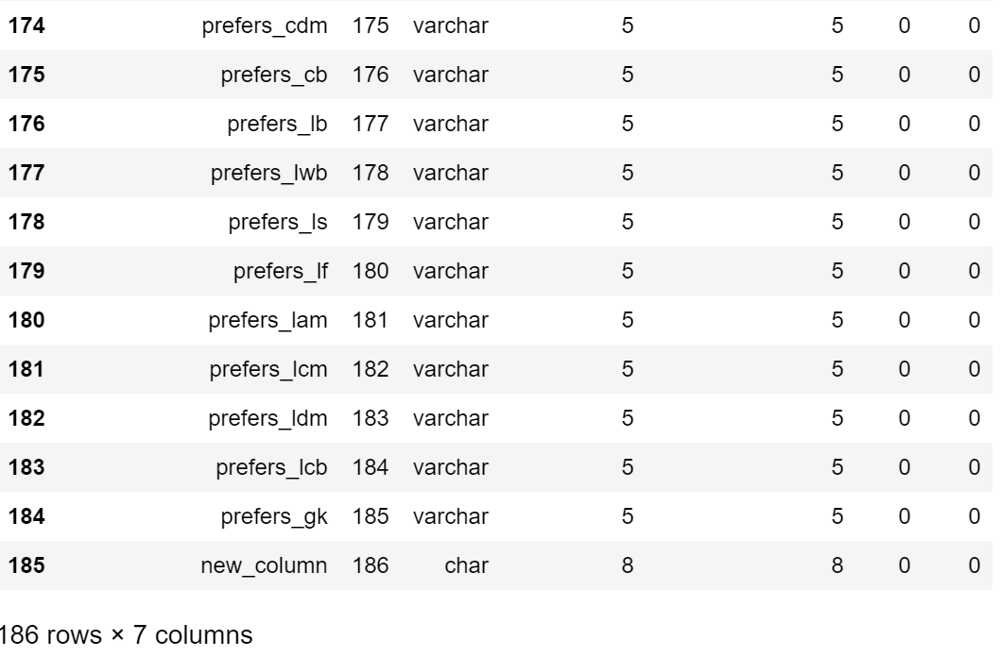

# Python 사용자를 위한 SAS viya 가이드

~~~tex
작성자 : hyunchang.byun@sas.com
작성일 : 2018.06
작성기준 : SAS Viya 3.3
~~~

##목차

[TOC]

***

## 1. 시작하기 전에

SAS Viya 플랫폼 상에서 Python을 이용하여 데이터준비 / 탐색 / 분석 / 모델 생성 / 호출 이라는 일련의 과정을  수행 하는 데 있어 도움 될 만한 내용으로 구성 하였습니다. 본 가이드는 크게 두가지 부분으로 구성 되어 있습니다.

### 파이썬 API 를 이용한 viya 사용

파이썬 API 를 이용하여 viya 서버에 접속하여 모델 생성 및 호출 하는 과정을 다룹니다.

### Jupyter Notebook 을 이용한 viya 사용

jupyter notebook 을 이용하여 viya 에 접속한후 데이터를 탐색하고, 그래프를 그래고, 최종적으로 viya 가 제공하는 머신러닝 알고리즘을 이용해 모델을 만들어 봅니다.


## 2. SAS Viya 아키텍처 이해하기


## 3. 파이썬 개발환경

본 가이드에 사용되는 개발 환경은 아래와 같습니다.

| 목록       | 구성내용    | 기타                           |
| ---------- | ----------- | ------------------------------ |
| 개발 IDE   | Pycharm     |                                |
| Python     | Python3.4   |                                |
| 프레임워크 | Django2.0.1 | GUI가 있는 예제에서만 사용     |
| 가상환경   | Anaconda    | virtualenv 를 써도 무방합니다. |

> Anaconda + Python3.4 + Django 설치 방법은 "부록. 개발환경 구축" 을 참조 하세요


### Python SWAT 라이브러리 설치하기

- SWAT 패키지 다운로드 및 설치
- - 다운로드 사이트 : [https://github.com/sassoftware/python-swat/releases](#)
  - 다운로드 후 서버에 적당한 위치에 업로드후 설치합니다.

```bash
pip install python-swat-1.3.0-linux64.tar.gz
```

> 기본 바이너리로 제공되는 것은 linux/osx/mac 이렇게 3가지 입니다. 만약 다른 OS를 사용한다면 소스를 다운받아 컴파일해서 설치 합니다. 그리고 참고로 osx 및 windows 버전의 경우 REST 로접속 하는 모드만 제공합니다. 접속하는 모드만 다를뿐 모든 API 는 동일합니다.


## 4. Viya 접속 및 CASLIB 설정

### Viya CAS 서버에 접속하기

~~~python
# swat 라이브러리 임포트
import swat

# Viya 의 CAS 서버 접속 정보 입력
conn = swat.CAS('https://sva8.sas.com/cas-shared-default-http/', 8777, 'username', 'password')

# 접속된 세션에 CASLIB 를 지정합니다.
conn.setsessopt(caslib='Public')

# help 함수를 이용하여 ActionSet 및 Action에 대한 리스트및 설명을 볼 수 있습니다.
out = conn.help()
~~~

![sasviya [~:venv:sasviya] - ...:src:conn_viya [sasviya] 2018-07-05 19-24-42](../img/sasviya [~:venv:sasviya] - ...:src:conn_viya [sasviya] 2018-07-05 19-24-42.png)

cas 라이브러리를 public 으로 설정하고 help 명령을 내리면 Action Set 과 Action 에 대한 목록을 보여 줍니다.

### ActionSet 과 Action

ActionSet 은 Action 들의 집합을 말합니다. Action 은 SAS Viya 의 CAS 서버에 내리는 명령어 모음 이라고 보시면 됩니다.

아래는 ActionSet 의 종류 입니다. 아래 표시한 내용보다 더 많으며, 중요한 것들만 표시 하였습니다.

| Action Set     | 주요 역할                                                    |
| -------------- | ------------------------------------------------------------ |
| accessControl  | 사용자의 접근제어 및 권한 관련 설정 API                      |
| builtins       | Viya 플랫폼 상태를 모니터링 하고 제어(가동/중지) 하는 API    |
| configuration  | CAS 서버에 대한 다양한 설정 API                              |
| dataPreprocess |                                                              |
| dataStep       | DataStep 관련 수행 API                                       |
| percentile     | 박스플롯 관련 기능, 모델 비교                                |
| search         |                                                              |
| session        |                                                              |
| sessionProp    |                                                              |
| simple         | 간단한 요약 통계 관련 API                                    |
| table          | CAS 테이블 관련 API (테이블 추가, 데이터 업로드, 컬럼변경, 데이터 셔플링 등) |

### Pandas DataFrame 과 SAS DataFrame

Python을 사용할 경우 Python DataFrame 을 사용할 수 있습니다. 어떤 분들은 당연히 라이브러리만 import 하면 사용 할 수 있는 것 아닌가? 하고 생각할 수도 있지만, Dataframe 을 통한 조회 / 변경 등이 모두 SAS Viya 분산 메모리 상에서 수행 됩니다. 즉, 별도의 Action 셋을 사용하지 않고 DataFrame 을 사용해서 데이터 조회및 변경이 가능 합니다.

예를들어 보도록 하겠습니다. 다음과 같은 Action을 이용해서 데이터 조회를 할수 있습니다.

~~~python
ㅇ
~~~


하지만, 데이타 과학자 라면 익숙한 DataFrame 을 사용해서 아래와 같이 데이터를 조회 할수 있습니다.

~~~
iris.loc[3:,'name':]
~~~

엄청 간단하지 않나요? 하지만 이모든 일들이 SAS Viya 의 CAS 서버에서 일어난다는 겁니다. 그래서 아무리 대용량 데이터라도 손쉽게 조회 및 조작을 할수 있습니다. 뿐만아니라 1시간 걸릴 작업은 단 몇초 혹은 몇분 만에 끝낼수 있습니다.


##5. 데이터 업로드 및 CAS 서버에 Promotion 하기

데이터를 서버에 업로드 하고 CAS 메모리 공간에 Promotion 하는데 다양한 방법을 제공합니다.


본 가이드는 SAS Viya 가 이미 설치 되었다고 가정 합니다. 

### 2. Viya 플랫폼에 Jupyter Notebook 설치

***

##### pip 설치

```bash
# yum install python-pip
```


##### jupyter notebook 설치

```bash
# pip install jupyter
```


##### numactl 패키지 설치

```bash
# yum install numactl
```

> numactl 은 SAS Viay의 CAS(Cloud Analytic Server) 서버와 바이너리 통신을 위해 필요한 라이브러리 입니다.


##### SWAT 패키지 다운로드 및 설치

+ 다운로드 사이트 : [https://github.com/sassoftware/python-swat/releases](#)

- 다운로드 후 서버에 적당한 위치에 업로드후 설치합니다.

```bash
# yum install python-swat-1.3.0-linux64.tar.gz
```


##### 클라이언트 인증서 환경변수 설정

```bash
export CAS_CLIENT_SSL_CA_LIST = "/opt/sas/viya/config/etc/SASSecurityCertificateFramework/cacerts/trustedcerts.pem"
```


##### Jupyter notebook 실행하기

```bash
# 모든네트워크 인터페이스 에서 포트를 열고, 작업 디렉토리를 설정 */
jupyter notebook --ip=* --notebook-dir=/home/sas
```


##### 간단한 소스를 통해 확인하기

```python
import swat
conn = swat.CAS('ip address', '5570', 'username','password')
conn.builtins.serverStatus()
```

> 바이너리 통신 포트 : 5570(default) , REST 통신포트 : 8777(default)


### 3. Viya 플랫폼에 Jupyter Hub 설치

***

##### 요구사항

+ 64bit Python 2.7 or 3.4-3.6 (리눅스)

- 바이너리 통신을 위한 libnuma.so.1 라이버리 (numactl 설치하면 됨) 
- 이미 SAS Viya 가 서버에 인스톨 되어야 합니다.

##### Anaconda 설치

- [Anaconda](#) 다운로드 및 설치

  

- 다운로드 : https://www.anaconda.com/download/ ( 64-bit 버전 다운로드)

- 서버의 적당한 디렉토리에 업로드

~~~bash
bash ./Anaconda3-5.1.0-Linux-x86_64.sh
~~~


> Anaconda 를 설치하는 이유는 리눅스 인톨 시 기본 python2.7 이 설치 되어 있어 가상 환경을 통해 추가로 설치 해야 합니다. 우선, 기본으로 설치되어 있는 python2.7은 OS 기본 바이너리에서 라이브러리를 참조하고 있기 때문에 업그레이드 한다면 문제가 발생 할수 있으며, python2.7과 python3.x 를 같이 설치해서 병행 할 수도 있으나 추후 운영 및 유지보수에 여러가지 어려움이 따르기 때문에 가상 환경에 설치 하는것이 가장 적합 합니다.

> 설치중 위와 같이 설치 위치를 물으면 직접 입력 합니다. (예: /usr/local/anaconda3)


##### 설치 위치 PATH 추가 하기

아나콘다 명령어를 바로 실행하기 위해 PATH 를 아래와 같이 .bash_profile 에 추가 합니다.

```bash
#]  vi ~/.bash_profile

# .bash_profile
PATH=$PATH:/usr/local/anaconda3/bin:$HOME/bin
```


##### 가상환경 생성

```bash
conda create --name jupyter-hub python=3.5 

# 생성된 가상환경 확인
conda info --envs
```


##### Jupyter Hub 설치

```bash
# 의존성 패키지 설치(nodejs / configurable-http-proxy)

curl --silent --location https://rpm.nodesource.com/setup_8.x | sudo bash -

yum -y install nodejs

npm install -g configurable-http-proxy


# 파이썬 가상 환경에서 수행

source activate jupyter-hub

pip install jupyterhub

pip install --upgrade notebook
```


##### 인증서 생성 (self signed Certificate)

인증서 생성 시에 각각의 질문 항목에 적절한 내용을 입력 합니다.

인증서 새성 후 cert 디렉토리로 이동하여 인증서가 생성 되었는지 확인 합니다.

```bash
openssl req -newkey rsa:4096 -nodes -sha512 -x509 -days 3650 -nodes -out /root/cert/cert.pem -keyout /root/cert/key.pem
```


##### Jupyterhub 실행

```bash
# Jupyter Hub 실행
jupyterhub --ip {your_ip_address} --port {ssl_port: eg 443} --ssl-cert /root/cert/cert.pem --ssl-key /root/cert/key.pem
```

url 로 접속하여 정상 유무를 확인 하고 Ctrl + C 로 서버를 중지 합니다.


##### SWAT Library 다운로드 및 설치

- SWAT 패키지 다운로드 및 설치
- - 다운로드 사이트 : [https://github.com/sassoftware/python-swat/releases](#)
  - 다운로드 후 서버에 적당한 위치에 업로드후 설치합니다.

```bash
yum install python-swat-1.3.0-linux64.tar.gz
```


##### Jupyterhub 재실행 및 접속

```bash
# Jupyter Hub 실행
jupyterhub --ip {your_ip_address} --port {ssl_port: eg 443} --ssl-cert /root/cert/cert.pem --ssl-key /root/cert/key.pem
```

[new] -> [python3] 선택하여 노트북 실행


##### 샘플 코드로 테스트 하기

```python
# OS 계정이 다르기 때문에 클라이언트 인증서에 대한 환경변수를 직접 입력 합니다. 
Import os
os.environ[‘CAS_CLIENT_SSL_CA_LIST’] = ‘/opt/sas/viya/config/etc/SASSecurityCertificateFramework/cacerts/trustedcerts.pem’

import swat
conn = swat.CAS('ip address', '5570', 'username','password')
conn.builtins.serverStatus()

```


### 4. Viya 구조 살펴보기

***

일단 Client 에 Jupyter notebook을 설치 하거나 서버에 Jupyter Notebook 을 설치 했으니 우리가 사용 하게 될 프로그래밍 환경이 어덯게 연결 및 구성 되어 있는지 살펴 보도록 하겠습니다.


#### 4.1 Viya Architecture

#### 4.2 CAS Library 이해하기


#### 4.3 Python DataFrame vs SAS DataFrame vs CAS DataFrame

#### 4.4 Binary vs REST

### 6. CAS 서버연결 하고 둘러보기

***

##### 서버 연결

~~~python
import os
import swat
os.environ['CAS_CLIENT_SSL_CA_LIST'] = '/opt/sas/viya/config/etc/SASSecurityCertificateFramework/cacerts/trustedcerts.pem'
cas = swat.CAS('casc.kolon.com', '5570', 'viya_sask01','viya')
~~~

##### 사용가능한 cas library 조회

~~~python
# 사용 가능한 라이버리 조회
cas.caslibinfo()
~~~


~~~python
# 도움말 목록 열기
cas.help()
~~~


help() 명령의 경우 사용가능한 Action Set 과 Action 들을 보여 주고 있습니다. Action Set 이란 Action 들의 모음 이며, 저자의 경우 Action Set 들은  총 11개 셋으로 아래와 같이 구성되어 있습니다. (구매한 라이센스 및 버전에 따라 다를 수 있습니다.)

| Action Set     | 주요 역할                                                    |
| -------------- | ------------------------------------------------------------ |
| accessControl  | 사용자의 접근제어 및 권한 관련 설정 API                      |
| builtins       | Viya 플랫폼 상태를 모니터링 하고 제어(가동/중지) 하는 API    |
| configuration  | CAS 서버에 대한 다양한 설정 API                              |
| dataPreprocess |                                                              |
| dataStep       | DataStep 관련 수행 API                                       |
| percentile     | 박스플롯 관련 기능, 모델 비교                                |
| search         |                                                              |
| session        |                                                              |
| sessionProp    |                                                              |
| simple         | 간단한 요약 통계 관련 API                                    |
| table          | CAS 테이블 관련 API (테이블 추가, 데이터 업로드, 컬럼변경, 데이터 셔플링 등) |

상세한 Action Set 과 Action 의 목록은 다음 URL 에서 확인 할 수 있습니다. 

[ActionSet and Action Link](http://documentation.sas.com/?cdcId=vdmmlcdc&cdcVersion=8.11&docsetId=allprodsactions&docsetTarget=titlepage.htm&locale=en)


##### CAS Action 사용해보기

+ 접속

  CAS 서버 접속시 포트 번호는 Binary 모드일 경우 '5570', RESTful 모드일 경우 '7879' 포트 입니다.

  Binary 모드가 통신 부하가 훨씬 적이 때문에 되도록 Binary 모드를 사용하는 것이 유리합니다.

~~~{python}
import os
import swat
os.environ['CAS_CLIENT_SSL_CA_LIST'] = '/opt/sas/viya/config/etc/SASSecurityCertificateFramework/cacerts/trustedcerts.pem'
conn = swat.CAS('casc.kolon.com', '5570', '{user_name}','{password}')
~~~

+ CSV 파일 다운로드

  [FIFA2018 플레이어 데이타](https://www.dropbox.com/s/n03jxl0rkjxrlmo/complete.csv?dl=0)

+ 파일 업로드 action 사용하기

~~~python
## 세션에서 사용되어질 CAS Library 를 셋팅 합니다.
## 위에서 CAS 서버에서 접속한 유저가 접근 가능한 디렉토리를 포함하는 CAS Library 를 선택 합니다.
## CAS Library 목록은 cas.caslibinfo() 으로 조회 하면 됩니다.

cas.setsessopt(caslib='CASUSER(viya_sask01)')

## 저자의 경우 jupyter hub 를 사용하기 때문에 jupyter hub 서버의 /home/saspy 디렉토리에 

table = conn.upload_file('/home/saspy/complete.csv', casout=dict(name='fifa2018', caslib='CASUSER(viya_sask01)'))
~~~

~~~
# tableinfo action
cas.tableinfo()
~~~

~~~
# columninfo action
cas.columninfo('FIFA2018')
~~~

~~~
FIFA = cas.CASTable('FIFA2018', caslib='CASUSER(viya_sask01)')
~~~

~~~
# pandas DataFrame function 사용
fifa.head()
~~~


~~~
# pandas DataFrame funtion 사용
fifa.tail()
~~~


위와 같이 정상적으로 파일이 업로드 되고 테이블 내용이 보이게 됩니다.

여기서, 주목해야 할 점은 SAS Viya 의 CAS 는 내부적으로 CAS DataFrame 을 사용하는데 Python의 Pandas DataFrame 을 상속 받아서 구현되어 있습니다. 따라서 CAS DataFrame 은 아래와 같이 생각해 볼 수 있습니다.

CAS DataFrame = Pandas DataFrame + SAS ActionSet + SAS MetaData 

하지만 보다 중요한 것은 Client-Side 에 메모리를 적재 하지 않고 서버 사이드에서 수행 한다는 것 입니다. 따라서 클라이언트의 성능과 무관하게 리포팅/분석/모델생성/모델 트레이닝 등을 수행 하게 됩니다.


### 7. CAS 서버에 데이타를 올려보자

***

지금 부터는 CAS ActionSet 을 이용해서 서버에 다양한 형태의 데이터를 Loading 하는 방법에 대해 살펴 보도록 하겠습니다. 

#### 클라이언트 로컬 파일을 이용한 로딩

6장에서 다룬 내용과 동일 합니다.


#### Pandas DataFrame 을 로딩

앞서 언급한 바와 같이 CAS 서버의 DataFrame 은 Python Pandas DataFrame 을 상속 받아 구현 되어 있습니다.

Pandas Dataframe 으로 저장된 데이터를 CAS 서버 메모리에 업로드 하고 Action 들을 수행 해 보도록 하겠습니다.

##### CAS 서버 접속

~~~python
import os
import swat
os.environ['CAS_CLIENT_SSL_CA_LIST'] = '/opt/sas/viya/config/etc/SASSecurityCertificateFramework/cacerts/trustedcerts.pem'
conn = swat.CAS('casc.kolon.com', '5570', '{user_name}','{password}')
~~~

##### 데이터를 불러와서 Pandas DataFrame 에 저장

~~~{python}
import pandas as pd
df = pd.read_csv('/home/saspy/complete.csv')
df.head()
~~~


~~~{python}
cas.upload(df,casout=dict(name='fifa2018_pd', caslib='CASUSER(viya_sask01)'))
# cas.upload(df) 처럼 간단하게 해도 됩니다. 다만 이경우 서버에서 테이블 이름을 자동생성 하고 아래 메시지에 이름을 출력해줍니다. 
~~~


업로두 후에 위와 같은 메시지가 나오면 정상적으로 로딩이 된것입니다. 이제 메모리에 로딩을 했으니 적제된 테이블을 연결할 컨텍스트 이름을 아래와 같이 'fifa2' 로 지정합니다.

~~~{python}
fifa2 = cas.CASTable('fifa2018_pd', caslib='CASUSER(viya_sask01)')
~~~

pandas head() 함수를 호출해서 데이터를 확인해봅시다. 

~~~{python}
fifa2.head()
~~~


### 8. DATA 준비

CAS 서버의 메모리에 로드된 데이터에 다양한 조작을 통해 시각화 및 분석을 위한 준비를 Python Pandas 를 이용해서 하는 방법을 알아 보도록 하겠습니다. 

#### 컬럼추가

fifa 데이터 셋에 "new_column" 이라는 컬럼을 공백 상태로 추가 합니다.

~~~{python}
fifa['new_column'] = ""
fifa.head()
~~~


오른쪽 맨 끝을 보시게 되면 'new_column ' 이라는 컬럼이 새로 생성 되었습니다. 그럼 해당 컬럼의 데이터 타입을 알아보기 위해 columninfo() 함수를 실행해 보겠습니다.

~~~{python}
fifa.columninfo()
~~~



일단 'new_column' 이라는 새로운 컬럼이 생성되었습니다. 다만 다른 컬럼들이 varchar 타입 인데 char 타입으로 생성 되었습니다.


#### 계산된 컬럼 추가


#### 컬럼분할하기

#### 컬럼 내용 변환

#### 결측 제거


### 9. DATA 탐색

### 10. 모델생성

### 11. 머신러닝 모델 생성


