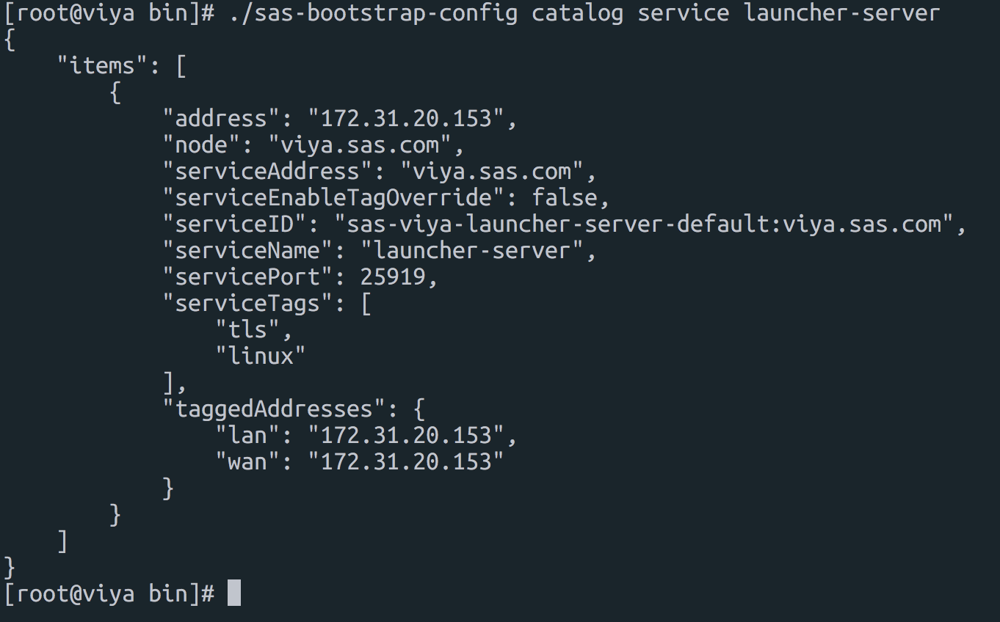

##SAS viya 3.3 to 3.4 upgrade Guide

[TOC]

### 1. 디렉토리 구조

| 디렉토리            | 설명                       |
| ------------------- | -------------------------- |
| /opt/install        | 3.3 인스톨 수행 디렉토리   |
| /opt/upgrade        | 3.4 인스톨 수행 디렉토리   |
| /opt/upgrade/mirror | 3.4 인스톨 미러 리포지토리 |


### 2. 업그레이드에 필요한 유틸리티

| 파일명                       | 설명                                                     | 다운로드 링크                                                |
| ---------------------------- | -------------------------------------------------------- | ------------------------------------------------------------ |
| sas-orchestration-linux.tgz  | ansible 플레이북 생성                                    | [다운로드](https://support.sas.com/en/documentation/install-center/viya/deployment-tools/34/command-line-interface.html) |
| mirrormgr-linux.tgz          | 설치 파일 다운로드 및 yum 로컬 리포지토리 구성 (1-6참조) | [다운로드](https://support.sas.com/en/documentation/install-center/viya/deployment-tools/34/mirror-manager.html) |
| SAS_Viya_deployment_data.zip | 라이센스 및 제품 목록 (1-4 참조)                         | 메일첨부                                                     |
| OpenLDAP-master.tar.gz       | 계정관리용 LDAP                                          | [다운로드](https://gitlab.sas.com/canepg/OpenLDAP) (SAS 네트워크) |

#### Mirror Manager 압축풀기

```
gunzip mirrormgr-linux.tgz
tar -xvf mirrormgr-linux.tar
```


#### SAS 미러 리포지토리 만들기

명령어 : mirrormgr mirror --deployment-data {path-to-SOE-file} --path {mirror-path} --platform {platform-tag} --log-file {log-file-path} --latest

```
./mirrormgr mirror --deployment-data /home/ec2-user/upgrade/SAS_Viya_deployment_data.zip --path /opt/upgrade/mirror --platform x64-redhat-linux-6 --log-file /home/ec2-user/upgrade/mirrormgr.log --latest
```


#### Ansible Playbook 생성

Ansible 을 통해 Viya3.4 업그레이드를  위해 ansible-playbook 을 생성 합니다. SOE 메일에 적힌 라이센스 허가 목록에 대해서만 Ansible playbook이 자동 생성 됩니다.

```
# 압축 풀기
gunzip sas-orchestration.tgz
tar -xvf sas-orchestration.tar

# Ansible Play Book 생성
./sas-orchestration build --input /home/ec2-user/upgrade/SAS_Viya_deployment_data.zip --repository-warehouse "file:///opt/upgrade/mirror" --platform redhat

# 플레이북 파일 install 디렉토리로 이동
cp SAS_Viya_playbook.tgz /opt/upgrade/

# 플레이북 압축 풀기
cd /opt/upgrade
tar -xvf SAS_Viya_playbook.tgz
```

> Platform TAG 정보는 oracle linux , redhat linux 의 경우 **redhat**, 수세리눅스의 경우 **suse**


### vars.yml 파일 복사

#### 수정되지 않은 3.3 vars.yml 파일 복사

~~~{bash}
cp /opt/install/sas_viya_playbook/samples/vars.yml /opt/upgrade/sas_viya_playbook/vars_original.yml
~~~

#### 3.3 인스톨시 수정된 vars.yml 파일 복사

~~~{bash}
cp /opt/install/sas_viya_playbook/vars.yml /opt/upgrade/sas_viya_playbook/vars_current.yml
~~~

#### 파일비교

~~~{bash}
cd /opt/upgrade/sas_viya_playbook
diff vars_current.yml vars.yml
~~~


#### 기존 sas 리포지토리 비활성화

~~~bash
ansible all -m shell --become --become-user=root -a 'yum remove --assumeyes $(rpm -qf --qf "::%{group}::%{name}\n" /etc/yum.repos.d/*.repo | sed -e "/^::SAS::/!d" -e "s/^::SAS:://" | sort -u)'
~~~


### Viya3.4 인스톨

#### 인스톨 수행

```
ansible-playbook -vvv site.yml
```


### 신규 caslib 추가 및 권한 부여 

~~~
/opt/sas/viya/home/share/deployment/add_new_caslib_controls.sh --sas-endpoint "http://viya.sas.com:80"
~~~


### 서비스 비활성화

~~~{bash}
export CONSUL_TOKEN=$(sudo cat /opt/sas/viya/config/etc/SASSecurityCertificateFramework/tokens/consul/default/client.token)
~~~


~~~{bash}
cd /opt/sas/viya/home/bin/
~~~


~~~{bash}
./sas-bootstrap-config catalog service launcher-server
~~~


~~~{bash}
./sas-bootstrap-config agent service deregister c1b9671c-8de4-4f89-94e9-fac6f7569f79

./sas-bootstrap-config agent service deregister 2b79ac1d-fe8f-4f7b-9027-f0432d72f675
~~~





~~~{bash}
./sas-bootstrap-config agent service list | grep -i backup-agent
~~~


~~~{bash}
./sas-bootstrap-config agent service deregister {ID}
~~~


### 서비스 비활성화 및 모니터링 제거

#### Viya 3.2 로부터 업그레이드 시 비활성화 및 모니터링 제거 대상 서비스

| 항목                    | 서비스명                             |
| ----------------------- | ------------------------------------ |
| SASHome                 | service name=sashome                 |
| home                    | service name=home                    |
| recipeExecutionProvider | service name=recipeexecutionprovider |
| SASVisualDataBuilder    | service name=sasvisualdatabuilder    |
| data-preparation-plans  | service name=data-preparation-plans  |

#### Viya 3.3 로부터 업그레이드 시 비활성화 및 모니터링 제거 대상 서비스

| 항목          | 서비스명                              |
| ------------- | ------------------------------------- |
| SASHome       | service name=sashome                  |
| home          | service name=home                     |
| SASJobMonitor | service name=datamanagementjobmonitor |
| SASProjects   | service name=datamanagementproject    |


#### 모니터링 제거 대상 조회

~~~{bash}
./sas-bootstrap-config agent check list | grep -i sashome
./sas-bootstrap-config agent check list | grep -i home
./sas-bootstrap-config agent check list | grep -i datamanagementjobmonitor
./sas-bootstrap-config agent check list | grep -i datamanagementproject
~~~


#### 모니터링 제거

~~~{bash}
./sas-bootstrap-config agent check deregister --id service:service-name-10-123-4-56
~~~


#### 비활성화 대상 서비스 조회

~~~{bash}
./sas-bootstrap-config agent service list | grep -i sashome
./sas-bootstrap-config agent service list | grep -i home
./sas-bootstrap-config agent service list | grep -i datamanagementjobmonitor
./sas-bootstrap-config agent service list | grep -i datamanagementproject
~~~


#### 서비스 비활성화

~~~{bash}
./sas-bootstrap-config agent service deregister service-name-10-123-4-56
~~~


